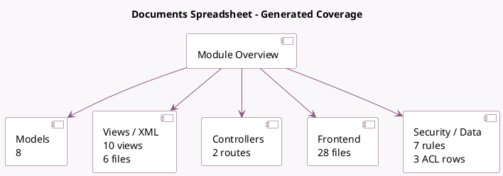

<!-- GENERATED:MODULE -->
---
tags: [odoo, enterprise, module]
---

# Documents Spreadsheet

- Scope: Enterprise Addons
- Source: enterprise/documents_spreadsheet
- Dependencies: [[docs/Enterprise Addons/documents/documents|documents]], [[docs/Enterprise Addons/spreadsheet_edition/spreadsheet_edition|spreadsheet_edition]], [[docs/Community Addons/base_import/base_import|base_import]]

## Summary

Documents Spreadsheet

## Generated coverage

- Models: 8
- XML files with UI/data artifacts: 6
- Views: 10
- Actions: 3
- Menus: 2
- Rules (ir.rule): 7
- Access CSV entries: 3
- Controller units: 1
- Frontend asset files: 28

## Module map

## Detail notes

- Models: [[docs/Enterprise Addons/documents_spreadsheet/Models|Models]] (8)
- Views and XML: [[docs/Enterprise Addons/documents_spreadsheet/Views|Views]] (6 files)
- Controllers: [[docs/Enterprise Addons/documents_spreadsheet/Controllers|Controllers]] (1)
- Frontend: [[docs/Enterprise Addons/documents_spreadsheet/Frontend|Frontend]] (28 files)

## Key models

- `documents.access`
- `documents.document`
- `documents.sharing`
- `ir.http`
- `save.spreadsheet.template`
- `spreadsheet.cell.thread`
- `spreadsheet.contributor`
- `spreadsheet.template`

## Navigation

- [[../Enterprise Addons/Enterprise Addons|Back to scope]]
- [[../../docs/docs|Back to docs]]

<!-- GENERATED:MODULE -->

