<!-- GENERATED:MODEL -->
---
tags: [odoo, enterprise, generated, model]
---

# equity.cap.table

- Module: [[docs/Enterprise Addons/equity/equity|equity]]
- Scope: Enterprise Addons
- Defined in module: yes
- Source files: `models/equity_cap_table.py`
- Python classes: `EquityCapTable`
- Description: Cap Table

## Field footprint

- Detected fields: 11
- Field types: `Float` x 7, `Many2one` x 3, `Selection` x 1
- Relation fields: 3

## Sample fields

- `dilution`: `Float`
- `dividend_payout`: `Float`
- `holder_id`: `Many2one` (comodel `res.partner`)
- `ownership`: `Float`
- `partner_id`: `Many2one` (comodel `res.partner`)
- `securities`: `Float`
- `securities_type`: `Selection` (related `security_class_id.class_type`)
- `security_class_id`: `Many2one` (comodel `equity.security.class`)
- `valuation`: `Float`
- `votes`: `Float`
- `voting_rights`: `Float`

## Method hints

- Detected methods: 4
- Action methods: none
- Compute methods: none
- Onchange methods: none

## Direct relation diagram

```plantuml
@startuml
!define ODOO_COLOR_PRIMARY #714B67
!define ODOO_COLOR_ACCENT #875A7B
!define ODOO_COLOR_BG #FAF7FA

skinparam backgroundColor ODOO_COLOR_BG
skinparam defaultTextAlignment left
skinparam ArrowColor ODOO_COLOR_ACCENT
skinparam ClassBackgroundColor white
skinparam ClassBorderColor ODOO_COLOR_PRIMARY
skinparam ComponentBackgroundColor white
skinparam ComponentBorderColor ODOO_COLOR_PRIMARY
skinparam NoteBackgroundColor #FFF8FF
skinparam NoteBorderColor ODOO_COLOR_ACCENT
skinparam SequenceLifeLineBorderColor ODOO_COLOR_ACCENT
skinparam SequenceLifeLineBackgroundColor #FFFFFF
skinparam SequenceParticipantBorderColor ODOO_COLOR_PRIMARY
skinparam SequenceParticipantBackgroundColor #FFFFFF
skinparam sequence {
  ArrowColor ODOO_COLOR_ACCENT
  ActorBorderColor ODOO_COLOR_PRIMARY
}
title equity.cap.table - Direct Relations
class "equity.cap.table" as equity_cap_table
class "equity.security.class" as equity_security_class
class "res.partner" as res_partner
equity_cap_table --> res_partner : partner_id
equity_cap_table --> res_partner : holder_id
equity_cap_table --> equity_security_class : security_class_id
@enduml
```

## Navigation

- **Parent:** [[docs/Enterprise Addons/equity/Models]]

<!-- GENERATED:MODEL -->
