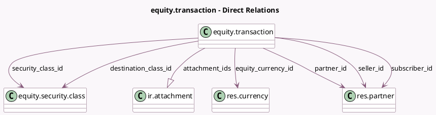

<!-- GENERATED:MODEL -->
---
tags: [odoo, enterprise, generated, model]
---

# equity.transaction

- Module: [[docs/Enterprise Addons/equity/equity|equity]]
- Scope: Enterprise Addons
- Defined in module: yes
- Source files: `models/equity_transaction.py`
- Python classes: `EquityTransaction`
- Description: Equity Transaction
- Inherits: `mail.thread`

## Field footprint

- Detected fields: 21
- Field types: `Char` x 3, `Date` x 2, `Float` x 2, `Integer` x 1, `Many2one` x 6, `Monetary` x 1, `One2many` x 1, `Selection` x 2, `Text` x 3
- Relation fields: 7

## Sample fields

- `attachment_ids`: `One2many` (comodel `ir.attachment`)
- `attachment_number`: `Integer` (compute `_compute_attachment_number`)
- `date`: `Date`
- `destination_class_id`: `Many2one` (comodel `equity.security.class`)
- `equity_currency_id`: `Many2one` (comodel `res.currency`, related `partner_id.equity_currency_id`)
- `expiration_date`: `Date` (compute `_compute_expiration_date`, store `True`)
- `expiration_diff`: `Text` (compute `_compute_expiration_diff`)
- `invalid_securities_error`: `Text` (compute `_compute_invalid_securities_error`)
- `notes`: `Text`
- `partner_id`: `Many2one` (comodel `res.partner`)
- `securities`: `Float`
- `securities_type`: `Selection` (related `security_class_id.class_type`)
- `security_class_id`: `Many2one` (comodel `equity.security.class`)
- `security_price`: `Float` (compute `_compute_security_price`, store `True`)
- `seller_id`: `Many2one` (comodel `res.partner`)
- `seller_name`: `Char` (compute `_compute_owners_names`)
- `subscriber_id`: `Many2one` (comodel `res.partner`)
- `subscriber_id_placeholder`: `Char` (compute `_compute_subscriber_id_placeholder`)
- `subscriber_name`: `Char` (compute `_compute_owners_names`)
- `transaction_type`: `Selection`

## Method hints

- Detected methods: 19
- Action methods: `action_transaction_seller_send`, `action_transaction_send`, `action_transaction_subscriber_send`
- Compute methods: `_compute_attachment_number`, `_compute_display_name`, `_compute_expiration_date`, `_compute_expiration_diff`, `_compute_invalid_securities_error`, `_compute_owners_names`, `_compute_security_price`, `_compute_subscriber_id_placeholder`, and 1 more
- Onchange methods: `_inverse_compute_transfer_amount`, `_onchange_transaction_type`

## Direct relation diagram

## Navigation

- **Parent:** [[docs/Enterprise Addons/equity/Models]]

<!-- GENERATED:MODEL -->
