<!-- GENERATED:MODEL -->
---
tags: [odoo, enterprise, generated, model]
---

# equity.ubo

- Module: [[docs/Enterprise Addons/equity/equity|equity]]
- Scope: Enterprise Addons
- Defined in module: yes
- Source files: `models/equity_ubo.py`
- Python classes: `EquityUbo`
- Description: Ultimate Beneficial Owner
- Inherits: `mail.thread`

## Field footprint

- Detected fields: 12
- Field types: `Boolean` x 2, `Date` x 3, `Float` x 2, `Many2one` x 2, `One2many` x 1, `Selection` x 2
- Relation fields: 3

## Sample fields

- `attachment_expiration_date`: `Date` (comodel `Document Exp. Date`)
- `attachment_ids`: `One2many` (comodel `ir.attachment`)
- `auth_rep_role`: `Selection`
- `control_method`: `Selection`
- `end_date`: `Date`
- `has_auth_rep_role`: `Boolean` (compute `_compute_has_auth_rep_role`)
- `has_percentages`: `Boolean` (compute `_compute_has_percentages`)
- `holder_id`: `Many2one` (comodel `res.partner`)
- `ownership`: `Float`
- `partner_id`: `Many2one` (comodel `res.partner`)
- `start_date`: `Date`
- `voting_rights`: `Float`

## Method hints

- Detected methods: 5
- Action methods: none
- Compute methods: `_compute_display_name`, `_compute_has_auth_rep_role`, `_compute_has_percentages`
- Onchange methods: `_onchange_control_method`

## Direct relation diagram

```plantuml
@startuml
!define ODOO_COLOR_PRIMARY #714B67
!define ODOO_COLOR_ACCENT #875A7B
!define ODOO_COLOR_BG #FAF7FA

skinparam backgroundColor ODOO_COLOR_BG
skinparam defaultTextAlignment left
skinparam ArrowColor ODOO_COLOR_ACCENT
skinparam ClassBackgroundColor white
skinparam ClassBorderColor ODOO_COLOR_PRIMARY
skinparam ComponentBackgroundColor white
skinparam ComponentBorderColor ODOO_COLOR_PRIMARY
skinparam NoteBackgroundColor #FFF8FF
skinparam NoteBorderColor ODOO_COLOR_ACCENT
skinparam SequenceLifeLineBorderColor ODOO_COLOR_ACCENT
skinparam SequenceLifeLineBackgroundColor #FFFFFF
skinparam SequenceParticipantBorderColor ODOO_COLOR_PRIMARY
skinparam SequenceParticipantBackgroundColor #FFFFFF
skinparam sequence {
  ArrowColor ODOO_COLOR_ACCENT
  ActorBorderColor ODOO_COLOR_PRIMARY
}
title equity.ubo - Direct Relations
class "equity.ubo" as equity_ubo
class "ir.attachment" as ir_attachment
class "res.partner" as res_partner
equity_ubo --> res_partner : partner_id
equity_ubo --> res_partner : holder_id
equity_ubo --|> ir_attachment : attachment_ids
@enduml
```

## Navigation

- **Parent:** [[docs/Enterprise Addons/equity/Models]]

<!-- GENERATED:MODEL -->
