<!-- GENERATED:MODEL -->
---
tags: [odoo, enterprise, generated, model]
---

# equity.valuation

- Module: [[docs/Enterprise Addons/equity/equity|equity]]
- Scope: Enterprise Addons
- Defined in module: yes
- Source files: `models/equity_valuation.py`
- Python classes: `EquityValuation`
- Description: Valuation
- Inherits: `mail.thread`

## Field footprint

- Detected fields: 11
- Field types: `Date` x 1, `Float` x 3, `Integer` x 1, `Many2one` x 2, `Monetary` x 2, `One2many` x 1, `Selection` x 1
- Relation fields: 3

## Sample fields

- `attachment_ids`: `One2many` (comodel `ir.attachment`)
- `attachment_number`: `Integer` (compute `_compute_attachment_number`)
- `date`: `Date`
- `equity_currency_id`: `Many2one` (comodel `res.currency`, related `partner_id.equity_currency_id`)
- `event`: `Selection`
- `partner_id`: `Many2one` (comodel `res.partner`)
- `securities`: `Float` (compute `_compute_securities`)
- `security_price`: `Monetary` (compute `_compute_security_price`)
- `share_price`: `Float` (compute `_compute_share_price`)
- `shares`: `Float` (compute `_compute_securities`)
- `valuation`: `Monetary`

## Method hints

- Detected methods: 8
- Action methods: none
- Compute methods: `_compute_attachment_number`, `_compute_display_name`, `_compute_securities`, `_compute_security_price`, `_compute_share_price`
- Onchange methods: `_inverse_compute_share_price`

## Direct relation diagram

```plantuml
@startuml
!define ODOO_COLOR_PRIMARY #714B67
!define ODOO_COLOR_ACCENT #875A7B
!define ODOO_COLOR_BG #FAF7FA

skinparam backgroundColor ODOO_COLOR_BG
skinparam defaultTextAlignment left
skinparam ArrowColor ODOO_COLOR_ACCENT
skinparam ClassBackgroundColor white
skinparam ClassBorderColor ODOO_COLOR_PRIMARY
skinparam ComponentBackgroundColor white
skinparam ComponentBorderColor ODOO_COLOR_PRIMARY
skinparam NoteBackgroundColor #FFF8FF
skinparam NoteBorderColor ODOO_COLOR_ACCENT
skinparam SequenceLifeLineBorderColor ODOO_COLOR_ACCENT
skinparam SequenceLifeLineBackgroundColor #FFFFFF
skinparam SequenceParticipantBorderColor ODOO_COLOR_PRIMARY
skinparam SequenceParticipantBackgroundColor #FFFFFF
skinparam sequence {
  ArrowColor ODOO_COLOR_ACCENT
  ActorBorderColor ODOO_COLOR_PRIMARY
}
title equity.valuation - Direct Relations
class "equity.valuation" as equity_valuation
class "ir.attachment" as ir_attachment
class "res.currency" as res_currency
class "res.partner" as res_partner
equity_valuation --> res_partner : partner_id
equity_valuation --> res_currency : equity_currency_id
equity_valuation --|> ir_attachment : attachment_ids
@enduml
```

## Navigation

- **Parent:** [[docs/Enterprise Addons/equity/Models]]

<!-- GENERATED:MODEL -->
