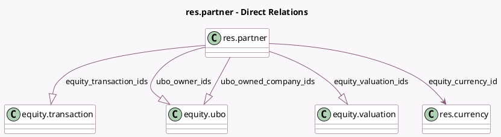

<!-- GENERATED:MODEL -->
---
tags: [odoo, enterprise, generated, model]
---

# res.partner

- Module: [[docs/Enterprise Addons/equity/equity|equity]]
- Scope: Enterprise Addons
- Defined in module: yes
- Source files: `models/res_partner.py`
- Python classes: `ResPartner`

## Field footprint

- Detected fields: 16
- Field types: `Boolean` x 1, `Char` x 5, `Date` x 2, `Integer` x 2, `Many2one` x 1, `One2many` x 4, `Text` x 1
- Relation fields: 5

## Sample fields

- `equity_access_token`: `Char`
- `equity_currency_id`: `Many2one` (comodel `res.currency`)
- `equity_formation_date`: `Date`
- `equity_kanban_dashboard_graph`: `Text` (compute `_compute_equity_kanban_dashboard_graph`)
- `equity_last_valuation`: `Char` (compute `_compute_equity_last_valuation`)
- `equity_legal_form`: `Char`
- `equity_shareholders_count`: `Integer` (compute `_compute_shareholders_count`)
- `equity_transaction_count`: `Integer` (compute `_compute_transaction_count`)
- `equity_transaction_ids`: `One2many` (comodel `equity.transaction`)
- `equity_valuation_ids`: `One2many` (comodel `equity.valuation`)
- `ubo_birth_date`: `Date`
- `ubo_birth_place`: `Char`
- `ubo_national_identifier`: `Char`
- `ubo_owned_company_ids`: `One2many` (comodel `equity.ubo`)
- `ubo_owner_ids`: `One2many` (comodel `equity.ubo`)
- `ubo_pep`: `Boolean`

## Method hints

- Detected methods: 16
- Action methods: `action_open_cap_table`, `action_open_transaction_list`, `action_open_valuation_list`, `action_partner_equity_send`
- Compute methods: `_compute_equity_kanban_dashboard_graph`, `_compute_equity_last_valuation`, `_compute_shareholders_count`, `_compute_transaction_count`
- Onchange methods: none

## Direct relation diagram

## Navigation

- **Parent:** [[docs/Enterprise Addons/equity/Models]]

<!-- GENERATED:MODEL -->
