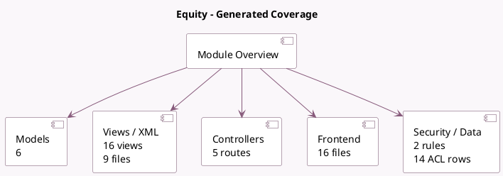

<!-- GENERATED:MODULE -->
---
tags: [odoo, enterprise, module]
---

# Equity

- Scope: Enterprise Addons
- Source: enterprise/equity
- Dependencies: [[docs/Community Addons/portal/portal|portal]]

## Summary

Manage securities, transactions, and cap tables.

## Generated coverage

- Models: 6
- XML files with UI/data artifacts: 9
- Views: 16
- Actions: 11
- Menus: 12
- Rules (ir.rule): 2
- Access CSV entries: 14
- Controller units: 1
- Frontend asset files: 16

## Module map

## Detail notes

- Models: [[docs/Enterprise Addons/equity/Models|Models]] (6)
- Views and XML: [[docs/Enterprise Addons/equity/Views|Views]] (9 files)
- Controllers: [[docs/Enterprise Addons/equity/Controllers|Controllers]] (1)
- Frontend: [[docs/Enterprise Addons/equity/Frontend|Frontend]] (16 files)

## Key models

- `equity.cap.table`
- `equity.security.class`
- `equity.transaction`
- `equity.ubo`
- `equity.valuation`
- `res.partner`

## Navigation

- [[../Enterprise Addons/Enterprise Addons|Back to scope]]
- [[../../docs/docs|Back to docs]]

<!-- GENERATED:MODULE -->

