<!-- GENERATED:MODEL -->
---
tags: [odoo, enterprise, generated, model]
---

# account.move.line

- Module: [[docs/Enterprise Addons/esg/esg|esg]]
- Scope: Enterprise Addons
- Defined in module: extension only
- Source files: `models/account_move_line.py`
- Python classes: `AccountMoveLine`

## Field footprint

- Detected fields: 5
- Field types: `Float` x 4, `Many2one` x 1
- Relation fields: 1

## Sample fields

- `esg_emission_factor_id`: `Many2one` (comodel `esg.emission.factor`, compute `_compute_esg_emission_factor_id`, store `True`)
- `esg_emission_multiplicator`: `Float` (compute `_compute_esg_emission_multiplicator`, store `True`)
- `esg_emissions_value`: `Float` (compute `_compute_esg_emissions_value`)
- `esg_uncertainty_absolute_value`: `Float` (compute `_compute_esg_uncertainty_absolute_value`)
- `esg_uncertainty_value`: `Float` (related `esg_emission_factor_id.esg_uncertainty_value`)

## Method hints

- Detected methods: 7
- Action methods: none
- Compute methods: `_compute_esg_emission_factor_id`, `_compute_esg_emission_multiplicator`, `_compute_esg_emissions_value`, `_compute_esg_uncertainty_absolute_value`
- Onchange methods: none

## Direct relation diagram

```plantuml
@startuml
!define ODOO_COLOR_PRIMARY #714B67
!define ODOO_COLOR_ACCENT #875A7B
!define ODOO_COLOR_BG #FAF7FA

skinparam backgroundColor ODOO_COLOR_BG
skinparam defaultTextAlignment left
skinparam ArrowColor ODOO_COLOR_ACCENT
skinparam ClassBackgroundColor white
skinparam ClassBorderColor ODOO_COLOR_PRIMARY
skinparam ComponentBackgroundColor white
skinparam ComponentBorderColor ODOO_COLOR_PRIMARY
skinparam NoteBackgroundColor #FFF8FF
skinparam NoteBorderColor ODOO_COLOR_ACCENT
skinparam SequenceLifeLineBorderColor ODOO_COLOR_ACCENT
skinparam SequenceLifeLineBackgroundColor #FFFFFF
skinparam SequenceParticipantBorderColor ODOO_COLOR_PRIMARY
skinparam SequenceParticipantBackgroundColor #FFFFFF
skinparam sequence {
  ArrowColor ODOO_COLOR_ACCENT
  ActorBorderColor ODOO_COLOR_PRIMARY
}
title account.move.line - Direct Relations
class "account.move.line" as account_move_line
class "esg.emission.factor" as esg_emission_factor
account_move_line --> esg_emission_factor : esg_emission_factor_id
@enduml
```

## Navigation

- **Parent:** [[docs/Enterprise Addons/esg/Models]]

<!-- GENERATED:MODEL -->
