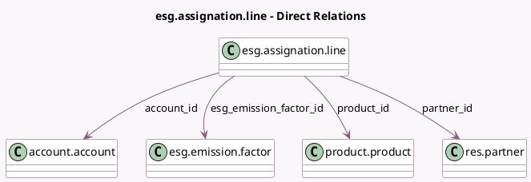

<!-- GENERATED:MODEL -->
---
tags: [odoo, enterprise, generated, model]
---

# esg.assignation.line

- Module: [[docs/Enterprise Addons/esg/esg|esg]]
- Scope: Enterprise Addons
- Defined in module: yes
- Source files: `models/esg_assignation_line.py`
- Python classes: `EsgAssignationLine`
- Description: Assignation Line

## Field footprint

- Detected fields: 4
- Field types: `Many2one` x 4
- Relation fields: 4

## Sample fields

- `account_id`: `Many2one` (comodel `account.account`)
- `esg_emission_factor_id`: `Many2one` (comodel `esg.emission.factor`)
- `partner_id`: `Many2one` (comodel `res.partner`)
- `product_id`: `Many2one` (comodel `product.product`)

## Method hints

- Detected methods: 1
- Action methods: none
- Compute methods: none
- Onchange methods: none

## Direct relation diagram

## Navigation

- **Parent:** [[docs/Enterprise Addons/esg/Models]]

<!-- GENERATED:MODEL -->
