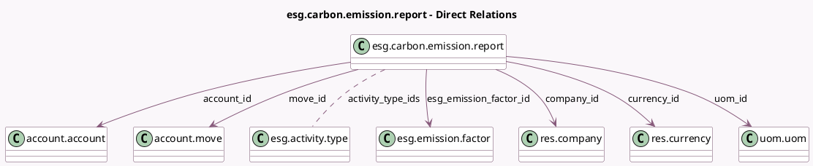

<!-- GENERATED:MODEL -->
---
tags: [odoo, enterprise, generated, model]
---

# esg.carbon.emission.report

- Module: [[docs/Enterprise Addons/esg/esg|esg]]
- Scope: Enterprise Addons
- Defined in module: yes
- Source files: `report/esg_carbon_emission_report.py`
- Python classes: `EsgCarbonEmissionReport`
- Description: ESG Carbon Emissions Report

## Field footprint

- Detected fields: 22
- Field types: `Date` x 2, `Float` x 4, `Integer` x 1, `Many2many` x 1, `Many2one` x 9, `Monetary` x 1, `Selection` x 2, `Text` x 2
- Relation fields: 10

## Sample fields

- `account_id`: `Many2one` (comodel `account.account`)
- `activity_type_ids`: `Many2many` (comodel `esg.activity.type`, related `esg_emission_factor_id.activity_type_ids`)
- `company_id`: `Many2one` (comodel `res.company`)
- `compute_method`: `Selection` (related `esg_emission_factor_id.compute_method`)
- `currency_id`: `Many2one` (comodel `res.currency`, compute `_compute_currency_id`, store `True`)
- `database_id`: `Many2one` (related `esg_emission_factor_id.database_id`)
- `date`: `Date`
- `date_end`: `Date`
- `esg_emission_factor_id`: `Many2one` (comodel `esg.emission.factor`)
- `esg_emissions_value`: `Float`
- `esg_emissions_value_t`: `Float`
- `esg_uncertainty_absolute_value`: `Float`
- `esg_uncertainty_value`: `Float` (related `esg_emission_factor_id.esg_uncertainty_value`)
- `move_id`: `Many2one` (comodel `account.move`)
- `name`: `Text`
- `note`: `Text`
- `partner_id`: `Many2one` (related `move_id.partner_id`)
- `price_subtotal`: `Monetary`
- `quantity`: `Integer`
- `scope`: `Selection` (related `source_id.scope`)

## Method hints

- Detected methods: 8
- Action methods: `action_open_emission_form`
- Compute methods: `_compute_currency_id`, `_compute_uom_id`
- Onchange methods: none

## Direct relation diagram

## Navigation

- **Parent:** [[docs/Enterprise Addons/esg/Models]]

<!-- GENERATED:MODEL -->
