<!-- GENERATED:MODEL -->
---
tags: [odoo, enterprise, generated, model]
---

# esg.emission.factor.line

- Module: [[docs/Enterprise Addons/esg/esg|esg]]
- Scope: Enterprise Addons
- Defined in module: yes
- Source files: `models/esg_emission_factor_line.py`
- Python classes: `EsgEmissionFactorLine`
- Description: Emission Factor Line
- Inherits: `mail.thread`

## Field footprint

- Detected fields: 5
- Field types: `Float` x 2, `Many2one` x 3
- Relation fields: 3

## Sample fields

- `activity_type_id`: `Many2one` (comodel `esg.activity.type`)
- `esg_emission_factor_id`: `Many2one` (comodel `esg.emission.factor`)
- `esg_emissions_value`: `Float` (compute `_compute_esg_emissions_value`, store `True`)
- `gas_id`: `Many2one` (comodel `esg.gas`)
- `quantity`: `Float`

## Method hints

- Detected methods: 3
- Action methods: none
- Compute methods: `_compute_display_name`, `_compute_esg_emissions_value`
- Onchange methods: none

## Direct relation diagram

```plantuml
@startuml
!define ODOO_COLOR_PRIMARY #714B67
!define ODOO_COLOR_ACCENT #875A7B
!define ODOO_COLOR_BG #FAF7FA

skinparam backgroundColor ODOO_COLOR_BG
skinparam defaultTextAlignment left
skinparam ArrowColor ODOO_COLOR_ACCENT
skinparam ClassBackgroundColor white
skinparam ClassBorderColor ODOO_COLOR_PRIMARY
skinparam ComponentBackgroundColor white
skinparam ComponentBorderColor ODOO_COLOR_PRIMARY
skinparam NoteBackgroundColor #FFF8FF
skinparam NoteBorderColor ODOO_COLOR_ACCENT
skinparam SequenceLifeLineBorderColor ODOO_COLOR_ACCENT
skinparam SequenceLifeLineBackgroundColor #FFFFFF
skinparam SequenceParticipantBorderColor ODOO_COLOR_PRIMARY
skinparam SequenceParticipantBackgroundColor #FFFFFF
skinparam sequence {
  ArrowColor ODOO_COLOR_ACCENT
  ActorBorderColor ODOO_COLOR_PRIMARY
}
title esg.emission.factor.line - Direct Relations
class "esg.emission.factor.line" as esg_emission_factor_line
class "esg.activity.type" as esg_activity_type
class "esg.emission.factor" as esg_emission_factor
class "esg.gas" as esg_gas
esg_emission_factor_line --> esg_emission_factor : esg_emission_factor_id
esg_emission_factor_line --> esg_activity_type : activity_type_id
esg_emission_factor_line --> esg_gas : gas_id
@enduml
```

## Navigation

- **Parent:** [[docs/Enterprise Addons/esg/Models]]

<!-- GENERATED:MODEL -->
