<!-- GENERATED:MODEL -->
---
tags: [odoo, enterprise, generated, model]
---

# esg.emission.factor

- Module: [[docs/Enterprise Addons/esg/esg|esg]]
- Scope: Enterprise Addons
- Defined in module: yes
- Source files: `models/esg_emission_factor.py`
- Python classes: `EsgEmissionFactor`
- Description: Emission Factor
- Inherits: `mail.thread`

## Field footprint

- Detected fields: 25
- Field types: `Boolean` x 1, `Char` x 5, `Date` x 2, `Float` x 2, `Html` x 1, `Integer` x 2, `Many2many` x 1, `Many2one` x 5, `One2many` x 4, `Selection` x 2
- Relation fields: 10

## Sample fields

- `account_move_line_ids`: `One2many` (comodel `account.move.line`)
- `active`: `Boolean`
- `activity_type_ids`: `Many2many` (comodel `esg.activity.type`, compute `_compute_activity_type_ids`, store `True`)
- `assignation_line_ids`: `One2many` (comodel `esg.assignation.line`)
- `code`: `Char`
- `company_id`: `Many2one` (comodel `res.company`)
- `compute_method`: `Selection`
- `currency_id`: `Many2one` (comodel `res.currency`, compute `_compute_currency_id`, store `True`)
- `database_id`: `Many2one` (comodel `esg.database`)
- `description`: `Html`
- `esg_emissions_value`: `Float` (compute `_compute_esg_emissions_value`, store `True`)
- `esg_other_emission_ids`: `One2many` (comodel `esg.other.emission`)
- `esg_uncertainty_value`: `Float`
- `gas_line_ids`: `One2many` (comodel `esg.emission.factor.line`)
- `name`: `Char`
- `nb_linked_emissions`: `Integer` (compute `_compute_nb_linked_emissions`)
- `region`: `Char` (comodel `Region / Regional Conditions`)
- `scope`: `Selection` (related `source_id.scope`)
- `scope_complete_name`: `Char` (related `source_id.complete_name`)
- `sequence`: `Integer`

## Method hints

- Detected methods: 7
- Action methods: `action_open_linked_emissions`
- Compute methods: `_compute_activity_type_ids`, `_compute_currency_id`, `_compute_esg_emissions_value`, `_compute_nb_linked_emissions`, `_compute_unit_name`, `_compute_uom_id`
- Onchange methods: none

## Direct relation diagram

```plantuml
@startuml
!define ODOO_COLOR_PRIMARY #714B67
!define ODOO_COLOR_ACCENT #875A7B
!define ODOO_COLOR_BG #FAF7FA

skinparam backgroundColor ODOO_COLOR_BG
skinparam defaultTextAlignment left
skinparam ArrowColor ODOO_COLOR_ACCENT
skinparam ClassBackgroundColor white
skinparam ClassBorderColor ODOO_COLOR_PRIMARY
skinparam ComponentBackgroundColor white
skinparam ComponentBorderColor ODOO_COLOR_PRIMARY
skinparam NoteBackgroundColor #FFF8FF
skinparam NoteBorderColor ODOO_COLOR_ACCENT
skinparam SequenceLifeLineBorderColor ODOO_COLOR_ACCENT
skinparam SequenceLifeLineBackgroundColor #FFFFFF
skinparam SequenceParticipantBorderColor ODOO_COLOR_PRIMARY
skinparam SequenceParticipantBackgroundColor #FFFFFF
skinparam sequence {
  ArrowColor ODOO_COLOR_ACCENT
  ActorBorderColor ODOO_COLOR_PRIMARY
}
title esg.emission.factor - Direct Relations
class "esg.emission.factor" as esg_emission_factor
class "account.move.line" as account_move_line
class "esg.activity.type" as esg_activity_type
class "esg.assignation.line" as esg_assignation_line
class "esg.database" as esg_database
class "esg.emission.factor.line" as esg_emission_factor_line
class "esg.emission.source" as esg_emission_source
class "esg.other.emission" as esg_other_emission
class "res.company" as res_company
class "res.currency" as res_currency
class "uom.uom" as uom_uom
esg_emission_factor --> esg_emission_source : source_id
esg_emission_factor --> res_company : company_id
esg_emission_factor --> esg_database : database_id
esg_emission_factor --|> esg_emission_factor_line : gas_line_ids
esg_emission_factor --|> esg_assignation_line : assignation_line_ids
esg_emission_factor --> uom_uom : uom_id
esg_emission_factor --> res_currency : currency_id
esg_emission_factor .. esg_activity_type : activity_type_ids
esg_emission_factor --|> account_move_line : account_move_line_ids
esg_emission_factor --|> esg_other_emission : esg_other_emission_ids
@enduml
```

## Navigation

- **Parent:** [[docs/Enterprise Addons/esg/Models]]

<!-- GENERATED:MODEL -->
