<!-- GENERATED:MODEL -->
---
tags: [odoo, enterprise, generated, model]
---

# esg.emission.source

- Module: [[docs/Enterprise Addons/esg/esg|esg]]
- Scope: Enterprise Addons
- Defined in module: yes
- Source files: `models/esg_emission_source.py`
- Python classes: `EsgEmissionSource`
- Description: Emission Source

## Field footprint

- Detected fields: 11
- Field types: `Char` x 3, `Integer` x 2, `Many2one` x 1, `One2many` x 1, `Selection` x 4
- Relation fields: 2

## Sample fields

- `activity_flow`: `Selection` (compute `_compute_activity_flow`)
- `activity_flow_direct_indirect`: `Selection` (compute `_compute_activity_flow`)
- `activity_flow_indirect_others`: `Selection`
- `child_ids`: `One2many` (comodel `esg.emission.source`)
- `complete_name`: `Char` (compute `_compute_complete_name`)
- `level`: `Integer` (compute `_compute_level`, store `True`)
- `name`: `Char`
- `parent_id`: `Many2one` (comodel `esg.emission.source`)
- `parent_path`: `Char`
- `scope`: `Selection` (compute `_compute_scope`, store `True`)
- `sequence`: `Integer`

## Method hints

- Detected methods: 6
- Action methods: none
- Compute methods: `_compute_activity_flow`, `_compute_complete_name`, `_compute_level`, `_compute_scope`
- Onchange methods: none

## Direct relation diagram

```plantuml
@startuml
!define ODOO_COLOR_PRIMARY #714B67
!define ODOO_COLOR_ACCENT #875A7B
!define ODOO_COLOR_BG #FAF7FA

skinparam backgroundColor ODOO_COLOR_BG
skinparam defaultTextAlignment left
skinparam ArrowColor ODOO_COLOR_ACCENT
skinparam ClassBackgroundColor white
skinparam ClassBorderColor ODOO_COLOR_PRIMARY
skinparam ComponentBackgroundColor white
skinparam ComponentBorderColor ODOO_COLOR_PRIMARY
skinparam NoteBackgroundColor #FFF8FF
skinparam NoteBorderColor ODOO_COLOR_ACCENT
skinparam SequenceLifeLineBorderColor ODOO_COLOR_ACCENT
skinparam SequenceLifeLineBackgroundColor #FFFFFF
skinparam SequenceParticipantBorderColor ODOO_COLOR_PRIMARY
skinparam SequenceParticipantBackgroundColor #FFFFFF
skinparam sequence {
  ArrowColor ODOO_COLOR_ACCENT
  ActorBorderColor ODOO_COLOR_PRIMARY
}
title esg.emission.source - Direct Relations
class "esg.emission.source" as esg_emission_source
class "esg.emission.source" as esg_emission_source
esg_emission_source --> esg_emission_source : parent_id
esg_emission_source --|> esg_emission_source : child_ids
@enduml
```

## Navigation

- **Parent:** [[docs/Enterprise Addons/esg/Models]]

<!-- GENERATED:MODEL -->
