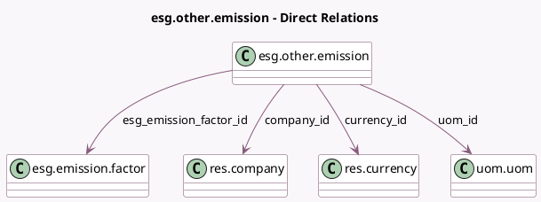

<!-- GENERATED:MODEL -->
---
tags: [odoo, enterprise, generated, model]
---

# esg.other.emission

- Module: [[docs/Enterprise Addons/esg/esg|esg]]
- Scope: Enterprise Addons
- Defined in module: yes
- Source files: `models/esg_other_emission.py`
- Python classes: `EsgOtherEmission`
- Description: Other Emission

## Field footprint

- Detected fields: 14
- Field types: `Char` x 1, `Date` x 2, `Float` x 4, `Integer` x 1, `Many2one` x 4, `Selection` x 1, `Text` x 1
- Relation fields: 4

## Sample fields

- `company_id`: `Many2one` (comodel `res.company`)
- `compute_method`: `Selection` (related `esg_emission_factor_id.compute_method`)
- `currency_id`: `Many2one` (comodel `res.currency`, compute `_compute_currency_id`, store `True`)
- `date`: `Date`
- `date_end`: `Date`
- `esg_emission_factor_id`: `Many2one` (comodel `esg.emission.factor`)
- `esg_emission_multiplicator`: `Float` (compute `_compute_esg_emission_multiplicator`, store `True`)
- `esg_emissions_value`: `Float` (compute `_compute_esg_emissions_value`)
- `esg_uncertainty_absolute_value`: `Float` (compute `_compute_esg_uncertainty_absolute_value`)
- `esg_uncertainty_value`: `Float` (related `esg_emission_factor_id.esg_uncertainty_value`)
- `name`: `Char`
- `note`: `Text`
- `quantity`: `Integer`
- `uom_id`: `Many2one` (comodel `uom.uom`, compute `_compute_uom_id`, store `True`)

## Method hints

- Detected methods: 6
- Action methods: none
- Compute methods: `_compute_currency_id`, `_compute_esg_emission_multiplicator`, `_compute_esg_emissions_value`, `_compute_esg_uncertainty_absolute_value`, `_compute_uom_id`
- Onchange methods: none

## Direct relation diagram

## Navigation

- **Parent:** [[docs/Enterprise Addons/esg/Models]]

<!-- GENERATED:MODEL -->
