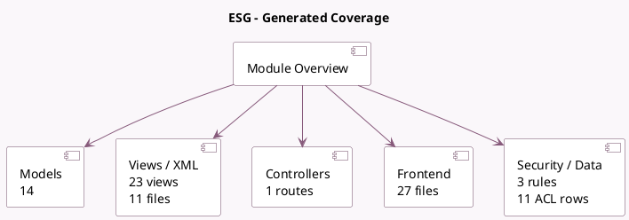

<!-- GENERATED:MODULE -->
---
tags: [odoo, enterprise, module]
---

# ESG

- Scope: Enterprise Addons
- Source: enterprise/esg
- Dependencies: [[docs/Enterprise Addons/account_reports/account_reports|account_reports]], [[docs/Community Addons/web_hierarchy/web_hierarchy|web_hierarchy]]

## Summary

Calculate and report your company's Environmental, Social, and Governance impact.

## Generated coverage

- Models: 14
- XML files with UI/data artifacts: 11
- Views: 23
- Actions: 11
- Menus: 17
- Rules (ir.rule): 3
- Access CSV entries: 11
- Controller units: 1
- Frontend asset files: 27

## Module map

## Detail notes

- Models: [[docs/Enterprise Addons/esg/Models|Models]] (14)
- Views and XML: [[docs/Enterprise Addons/esg/Views|Views]] (11 files)
- Controllers: [[docs/Enterprise Addons/esg/Controllers|Controllers]] (1)
- Frontend: [[docs/Enterprise Addons/esg/Frontend|Frontend]] (27 files)

## Key models

- `account.account`
- `account.move`
- `account.move.line`
- `esg.activity.type`
- `esg.assignation.line`
- `esg.carbon.emission.report`
- `esg.carbon.report.handler`
- `esg.database`
- `esg.emission.factor`
- `esg.emission.factor.line`
- `esg.emission.source`
- `esg.gas`

## Navigation

- [[../Enterprise Addons/Enterprise Addons|Back to scope]]
- [[../../docs/docs|Back to docs]]

<!-- GENERATED:MODULE -->

