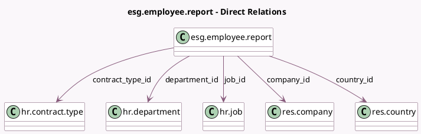

<!-- GENERATED:MODEL -->
---
tags: [odoo, enterprise, generated, model]
---

# esg.employee.report

- Module: [[docs/Enterprise Addons/esg_hr/esg_hr|esg_hr]]
- Scope: Enterprise Addons
- Defined in module: yes
- Source files: `report/esg_employee_report.py`
- Python classes: `EsgEmployeeReport`
- Description: ESG Employee Report

## Field footprint

- Detected fields: 11
- Field types: `Boolean` x 2, `Float` x 1, `Integer` x 2, `Many2one` x 5, `Selection` x 1
- Relation fields: 5

## Sample fields

- `company_id`: `Many2one` (comodel `res.company`)
- `contract_type_id`: `Many2one` (comodel `hr.contract.type`)
- `count`: `Integer`
- `country_id`: `Many2one` (comodel `res.country`)
- `department_id`: `Many2one` (comodel `hr.department`)
- `is_full_time`: `Boolean`
- `is_team_leader`: `Boolean`
- `job_id`: `Many2one` (comodel `hr.job`)
- `leadership_level`: `Integer`
- `sex`: `Selection`
- `wage`: `Float` (comodel `Wage`)

## Method hints

- Detected methods: 8
- Action methods: none
- Compute methods: none
- Onchange methods: none

## Direct relation diagram

## Navigation

- **Parent:** [[docs/Enterprise Addons/esg_hr/Models]]

<!-- GENERATED:MODEL -->
