<!-- GENERATED:MODEL -->
---
tags: [odoo, enterprise, generated, model]
---

# employee.commuting.emissions.wizard

- Module: [[docs/Enterprise Addons/esg_hr_fleet/esg_hr_fleet|esg_hr_fleet]]
- Scope: Enterprise Addons
- Defined in module: yes
- Source files: `wizard/employee_commuting_emissions_wizard.py`
- Python classes: `EmployeeCommutingEmissionsWizard`
- Description: Generate emitted emissions from employee commuting

## Field footprint

- Detected fields: 3
- Field types: `Date` x 2, `Many2many` x 1
- Relation fields: 1

## Sample fields

- `conflicting_emission_ids`: `Many2many` (comodel `esg.other.emission`, compute `_compute_conflicting_emission_ids`)
- `date_end`: `Date`
- `date_start`: `Date` (comodel `Emissions Period`)

## Method hints

- Detected methods: 4
- Action methods: `action_save`, `action_see_conflicting_emissions`
- Compute methods: `_compute_conflicting_emission_ids`
- Onchange methods: none

## Direct relation diagram

```plantuml
@startuml
!define ODOO_COLOR_PRIMARY #714B67
!define ODOO_COLOR_ACCENT #875A7B
!define ODOO_COLOR_BG #FAF7FA

skinparam backgroundColor ODOO_COLOR_BG
skinparam defaultTextAlignment left
skinparam ArrowColor ODOO_COLOR_ACCENT
skinparam ClassBackgroundColor white
skinparam ClassBorderColor ODOO_COLOR_PRIMARY
skinparam ComponentBackgroundColor white
skinparam ComponentBorderColor ODOO_COLOR_PRIMARY
skinparam NoteBackgroundColor #FFF8FF
skinparam NoteBorderColor ODOO_COLOR_ACCENT
skinparam SequenceLifeLineBorderColor ODOO_COLOR_ACCENT
skinparam SequenceLifeLineBackgroundColor #FFFFFF
skinparam SequenceParticipantBorderColor ODOO_COLOR_PRIMARY
skinparam SequenceParticipantBackgroundColor #FFFFFF
skinparam sequence {
  ArrowColor ODOO_COLOR_ACCENT
  ActorBorderColor ODOO_COLOR_PRIMARY
}
title employee.commuting.emissions.wizard - Direct Relations
class "employee.commuting.emissions.wizard" as employee_commuting_emissions_wizard
class "esg.other.emission" as esg_other_emission
employee_commuting_emissions_wizard .. esg_other_emission : conflicting_emission_ids
@enduml
```

## Navigation

- **Parent:** [[docs/Enterprise Addons/esg_hr_fleet/Models]]

<!-- GENERATED:MODEL -->
