<!-- GENERATED:MODEL -->
---
tags: [odoo, enterprise, generated, model]
---

# esg.employee.commuting.report

- Module: [[docs/Enterprise Addons/esg_hr_fleet/esg_hr_fleet|esg_hr_fleet]]
- Scope: Enterprise Addons
- Defined in module: yes
- Source files: `report/esg_employee_commuting_report.py`
- Python classes: `EsgEmployeeCommutingReport`
- Description: ESG Employee Commuting Report

## Field footprint

- Detected fields: 8
- Field types: `Date` x 2, `Float` x 3, `Many2one` x 3
- Relation fields: 3

## Sample fields

- `co2`: `Float` (comodel `gCO₂/km`)
- `company_id`: `Many2one` (comodel `res.company`)
- `date_from`: `Date` (comodel `Date`)
- `date_to`: `Date`
- `driver_id`: `Many2one` (comodel `res.partner`)
- `total_co2`: `Float` (comodel `tCO₂`)
- `total_distance`: `Float` (comodel `km`)
- `vehicle_id`: `Many2one` (comodel `fleet.vehicle`)

## Method hints

- Detected methods: 1
- Action methods: none
- Compute methods: none
- Onchange methods: none

## Direct relation diagram

```plantuml
@startuml
!define ODOO_COLOR_PRIMARY #714B67
!define ODOO_COLOR_ACCENT #875A7B
!define ODOO_COLOR_BG #FAF7FA

skinparam backgroundColor ODOO_COLOR_BG
skinparam defaultTextAlignment left
skinparam ArrowColor ODOO_COLOR_ACCENT
skinparam ClassBackgroundColor white
skinparam ClassBorderColor ODOO_COLOR_PRIMARY
skinparam ComponentBackgroundColor white
skinparam ComponentBorderColor ODOO_COLOR_PRIMARY
skinparam NoteBackgroundColor #FFF8FF
skinparam NoteBorderColor ODOO_COLOR_ACCENT
skinparam SequenceLifeLineBorderColor ODOO_COLOR_ACCENT
skinparam SequenceLifeLineBackgroundColor #FFFFFF
skinparam SequenceParticipantBorderColor ODOO_COLOR_PRIMARY
skinparam SequenceParticipantBackgroundColor #FFFFFF
skinparam sequence {
  ArrowColor ODOO_COLOR_ACCENT
  ActorBorderColor ODOO_COLOR_PRIMARY
}
title esg.employee.commuting.report - Direct Relations
class "esg.employee.commuting.report" as esg_employee_commuting_report
class "fleet.vehicle" as fleet_vehicle
class "res.company" as res_company
class "res.partner" as res_partner
esg_employee_commuting_report --> res_partner : driver_id
esg_employee_commuting_report --> fleet_vehicle : vehicle_id
esg_employee_commuting_report --> res_company : company_id
@enduml
```

## Navigation

- **Parent:** [[docs/Enterprise Addons/esg_hr_fleet/Models]]

<!-- GENERATED:MODEL -->
