<!-- GENERATED:MODEL -->
---
tags: [odoo, enterprise, generated, model]
---

# fleet.vehicle.assignation.log

- Module: [[docs/Enterprise Addons/esg_hr_fleet/esg_hr_fleet|esg_hr_fleet]]
- Scope: Enterprise Addons
- Defined in module: extension only
- Source files: `models/fleet_vehicle_assignation_log.py`
- Python classes: `FleetVehicleAssignationLog`

## Field footprint

- Detected fields: 1
- Field types: `Many2one` x 1
- Relation fields: 1

## Sample fields

- `company_id`: `Many2one` (comodel `res.company`, related `vehicle_id.company_id`)

## Method hints

- Detected methods: 0
- Action methods: none
- Compute methods: none
- Onchange methods: none

## Direct relation diagram

```plantuml
@startuml
!define ODOO_COLOR_PRIMARY #714B67
!define ODOO_COLOR_ACCENT #875A7B
!define ODOO_COLOR_BG #FAF7FA

skinparam backgroundColor ODOO_COLOR_BG
skinparam defaultTextAlignment left
skinparam ArrowColor ODOO_COLOR_ACCENT
skinparam ClassBackgroundColor white
skinparam ClassBorderColor ODOO_COLOR_PRIMARY
skinparam ComponentBackgroundColor white
skinparam ComponentBorderColor ODOO_COLOR_PRIMARY
skinparam NoteBackgroundColor #FFF8FF
skinparam NoteBorderColor ODOO_COLOR_ACCENT
skinparam SequenceLifeLineBorderColor ODOO_COLOR_ACCENT
skinparam SequenceLifeLineBackgroundColor #FFFFFF
skinparam SequenceParticipantBorderColor ODOO_COLOR_PRIMARY
skinparam SequenceParticipantBackgroundColor #FFFFFF
skinparam sequence {
  ArrowColor ODOO_COLOR_ACCENT
  ActorBorderColor ODOO_COLOR_PRIMARY
}
title fleet.vehicle.assignation.log - Direct Relations
class "fleet.vehicle.assignation.log" as fleet_vehicle_assignation_log
class "res.company" as res_company
fleet_vehicle_assignation_log --> res_company : company_id
@enduml
```

## Navigation

- **Parent:** [[docs/Enterprise Addons/esg_hr_fleet/Models]]

<!-- GENERATED:MODEL -->
