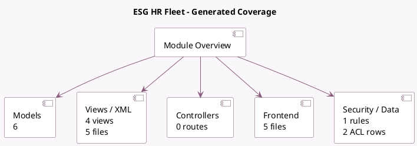

<!-- GENERATED:MODULE -->
---
tags: [odoo, enterprise, module]
---

# ESG HR Fleet

- Scope: Enterprise Addons
- Source: enterprise/esg_hr_fleet
- Dependencies: [[docs/Enterprise Addons/esg/esg|esg]], [[docs/Community Addons/hr_fleet/hr_fleet|hr_fleet]]

## Summary

Measure fleet emissions based on your employees' commuting distance and vehicle data.

## Generated coverage

- Models: 6
- XML files with UI/data artifacts: 5
- Views: 4
- Actions: 3
- Menus: 3
- Rules (ir.rule): 1
- Access CSV entries: 2
- Controller units: 0
- Frontend asset files: 5

## Module map

## Detail notes

- Models: [[docs/Enterprise Addons/esg_hr_fleet/Models|Models]] (6)
- Views and XML: [[docs/Enterprise Addons/esg_hr_fleet/Views|Views]] (5 files)
- Frontend: [[docs/Enterprise Addons/esg_hr_fleet/Frontend|Frontend]] (5 files)

## Key models

- `employee.commuting.emissions.wizard`
- `esg.employee.commuting.report`
- `esg.other.emission`
- `fleet.vehicle.assignation.log`
- `res.company`
- `res.config.settings`

## Navigation

- [[../Enterprise Addons/Enterprise Addons|Back to scope]]
- [[../../docs/docs|Back to docs]]

<!-- GENERATED:MODULE -->

