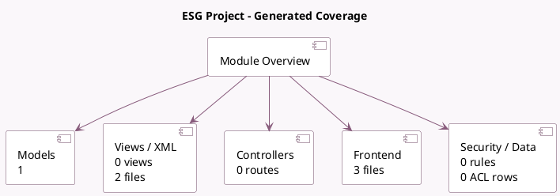

<!-- GENERATED:MODULE -->
---
tags: [odoo, enterprise, module]
---

# ESG Project

- Scope: Enterprise Addons
- Source: enterprise/esg_project
- Dependencies: [[docs/Enterprise Addons/esg/esg|esg]], [[docs/Enterprise Addons/project_enterprise/project_enterprise|project_enterprise]]

## Summary

Create and manage ESG initiatives to act on your impact.

## Generated coverage

- Models: 1
- XML files with UI/data artifacts: 2
- Views: 0
- Actions: 2
- Menus: 2
- Rules (ir.rule): 0
- Access CSV entries: 0
- Controller units: 0
- Frontend asset files: 3

## Module map

## Detail notes

- Models: [[docs/Enterprise Addons/esg_project/Models|Models]] (1)
- Views and XML: [[docs/Enterprise Addons/esg_project/Views|Views]] (2 files)
- Frontend: [[docs/Enterprise Addons/esg_project/Frontend|Frontend]] (3 files)

## Key models

- `project.project`

## Navigation

- [[../Enterprise Addons/Enterprise Addons|Back to scope]]
- [[../../docs/docs|Back to docs]]

<!-- GENERATED:MODULE -->

