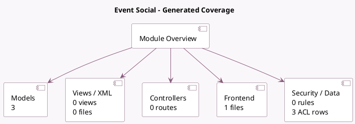

<!-- GENERATED:MODULE -->
---
tags: [odoo, enterprise, module]
---

# Event Social

- Scope: Enterprise Addons
- Source: enterprise/event_social
- Dependencies: [[docs/Community Addons/event/event|event]], [[docs/Enterprise Addons/social/social|social]]

## Summary

Publish on social account from Event

## Generated coverage

- Models: 3
- XML files with UI/data artifacts: 0
- Views: 0
- Actions: 0
- Menus: 0
- Rules (ir.rule): 0
- Access CSV entries: 3
- Controller units: 0
- Frontend asset files: 1

## Module map

## Detail notes

- Models: [[docs/Enterprise Addons/event_social/Models|Models]] (3)
- Frontend: [[docs/Enterprise Addons/event_social/Frontend|Frontend]] (1 files)

## Key models

- `event.mail`
- `event.type.mail`
- `social.post.template`

## Navigation

- [[../Enterprise Addons/Enterprise Addons|Back to scope]]
- [[../../docs/docs|Back to docs]]

<!-- GENERATED:MODULE -->

