<!-- GENERATED:MODEL -->
---
tags: [odoo, enterprise, generated, model]
---

# frontdesk.drink

- Module: [[docs/Enterprise Addons/frontdesk/frontdesk|frontdesk]]
- Scope: Enterprise Addons
- Defined in module: yes
- Source files: `models/frontdesk_drink.py`
- Python classes: `FrontdeskDrink`
- Description: Frontdesk Drink

## Field footprint

- Detected fields: 5
- Field types: `Boolean` x 1, `Char` x 1, `Image` x 1, `Integer` x 1, `Many2many` x 1
- Relation fields: 1

## Sample fields

- `active`: `Boolean`
- `drink_image`: `Image`
- `name`: `Char` (comodel `Name`)
- `notify_user_ids`: `Many2many` (comodel `res.users`)
- `sequence`: `Integer`

## Method hints

- Detected methods: 0
- Action methods: none
- Compute methods: none
- Onchange methods: none

## Direct relation diagram

```plantuml
@startuml
!define ODOO_COLOR_PRIMARY #714B67
!define ODOO_COLOR_ACCENT #875A7B
!define ODOO_COLOR_BG #FAF7FA

skinparam backgroundColor ODOO_COLOR_BG
skinparam defaultTextAlignment left
skinparam ArrowColor ODOO_COLOR_ACCENT
skinparam ClassBackgroundColor white
skinparam ClassBorderColor ODOO_COLOR_PRIMARY
skinparam ComponentBackgroundColor white
skinparam ComponentBorderColor ODOO_COLOR_PRIMARY
skinparam NoteBackgroundColor #FFF8FF
skinparam NoteBorderColor ODOO_COLOR_ACCENT
skinparam SequenceLifeLineBorderColor ODOO_COLOR_ACCENT
skinparam SequenceLifeLineBackgroundColor #FFFFFF
skinparam SequenceParticipantBorderColor ODOO_COLOR_PRIMARY
skinparam SequenceParticipantBackgroundColor #FFFFFF
skinparam sequence {
  ArrowColor ODOO_COLOR_ACCENT
  ActorBorderColor ODOO_COLOR_PRIMARY
}
title frontdesk.drink - Direct Relations
class "frontdesk.drink" as frontdesk_drink
class "res.users" as res_users
frontdesk_drink .. res_users : notify_user_ids
@enduml
```

## Navigation

- **Parent:** [[docs/Enterprise Addons/frontdesk/Models]]

<!-- GENERATED:MODEL -->
