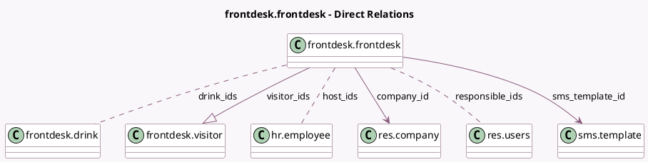

<!-- GENERATED:MODEL -->
---
tags: [odoo, enterprise, generated, model]
---

# frontdesk.frontdesk

- Module: [[docs/Enterprise Addons/frontdesk/frontdesk|frontdesk]]
- Scope: Enterprise Addons
- Defined in module: yes
- Source files: `models/frontdesk_frontdesk.py`
- Python classes: `FrontdeskFrontdesk`
- Description: Frontdesk

## Field footprint

- Detected fields: 30
- Field types: `Boolean` x 9, `Char` x 5, `Html` x 1, `Image` x 1, `Integer` x 3, `Many2many` x 3, `Many2one` x 2, `One2many` x 1, `PropertiesDefinition` x 1, `Selection` x 4
- Relation fields: 6

## Sample fields

- `access_token`: `Char` (comodel `Security Token`)
- `active`: `Boolean`
- `ask_company`: `Selection`
- `ask_email`: `Selection`
- `ask_phone`: `Selection`
- `authenticate_guest`: `Boolean` (comodel `Authenticate Guest`)
- `company_id`: `Many2one` (comodel `res.company`)
- `description`: `Html`
- `drink_ids`: `Many2many` (comodel `frontdesk.drink`)
- `drink_offer`: `Boolean` (comodel `Offer Drinks`)
- `drink_to_serve`: `Integer` (comodel `Drinks to Serve`, compute `_compute_dashboard_data`)
- `guest_on_site`: `Integer` (comodel `Guests On Site`, compute `_compute_dashboard_data`)
- `host_ids`: `Many2many` (comodel `hr.employee`)
- `host_selection`: `Boolean` (comodel `Host Selection`)
- `image`: `Image` (comodel `Image`)
- `is_favorite`: `Boolean`
- `kiosk_url`: `Char` (comodel `Kiosk URL`, compute `_compute_kiosk_url`)
- `latest_check_in`: `Char` (compute `_compute_dashboard_data`)
- `name`: `Char` (comodel `Frontdesk Name`)
- `notify_discuss`: `Boolean` (comodel `Notify by discuss`)

## Method hints

- Detected methods: 13
- Action methods: `action_open_kiosk`, `action_open_visitors`
- Compute methods: `_compute_dashboard_data`, `_compute_kiosk_url`, `_compute_notify_warning`
- Onchange methods: `_onchange_company_id`

## Direct relation diagram

## Navigation

- **Parent:** [[docs/Enterprise Addons/frontdesk/Models]]

<!-- GENERATED:MODEL -->
