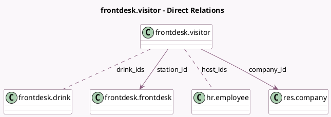

<!-- GENERATED:MODEL -->
---
tags: [odoo, enterprise, generated, model]
---

# frontdesk.visitor

- Module: [[docs/Enterprise Addons/frontdesk/frontdesk|frontdesk]]
- Scope: Enterprise Addons
- Defined in module: yes
- Source files: `models/frontdesk_visitor.py`
- Python classes: `FrontdeskVisitor`
- Description: Frontdesk Visitors
- Inherits: `mail.thread`

## Field footprint

- Detected fields: 16
- Field types: `Boolean` x 2, `Char` x 4, `Datetime` x 2, `Float` x 1, `Html` x 1, `Many2many` x 2, `Many2one` x 2, `Properties` x 1, `Selection` x 1
- Relation fields: 4

## Sample fields

- `active`: `Boolean`
- `check_in`: `Datetime`
- `check_out`: `Datetime`
- `company`: `Char` (comodel `Visitor Company`)
- `company_id`: `Many2one` (comodel `res.company`)
- `drink_ids`: `Many2many` (comodel `frontdesk.drink`)
- `duration`: `Float` (comodel `Duration`, compute `_compute_duration`, store `True`)
- `email`: `Char` (comodel `Email`)
- `host_ids`: `Many2many` (comodel `hr.employee`)
- `message`: `Html`
- `name`: `Char` (comodel `Name`)
- `phone`: `Char` (comodel `Phone`)
- `served`: `Boolean`
- `state`: `Selection`
- `station_id`: `Many2one` (comodel `frontdesk.frontdesk`)
- `visitor_properties`: `Properties` (comodel `Properties`)

## Method hints

- Detected methods: 16
- Action methods: `action_canceled`, `action_check_in`, `action_check_out`, `action_planned`, `action_served`
- Compute methods: `_compute_duration`
- Onchange methods: none

## Direct relation diagram

## Navigation

- **Parent:** [[docs/Enterprise Addons/frontdesk/Models]]

<!-- GENERATED:MODEL -->
