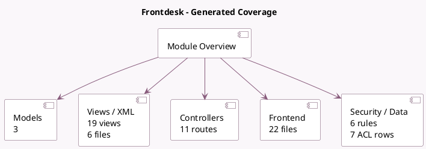

<!-- GENERATED:MODULE -->
---
tags: [odoo, enterprise, module]
---

# Frontdesk

- Scope: Enterprise Addons
- Source: enterprise/frontdesk
- Dependencies: [[docs/Community Addons/hr/hr|hr]], [[docs/Community Addons/sms/sms|sms]]

## Summary

Visitor management system

## Generated coverage

- Models: 3
- XML files with UI/data artifacts: 6
- Views: 19
- Actions: 14
- Menus: 9
- Rules (ir.rule): 6
- Access CSV entries: 7
- Controller units: 1
- Frontend asset files: 22

## Module map

## Detail notes

- Models: [[docs/Enterprise Addons/frontdesk/Models|Models]] (3)
- Views and XML: [[docs/Enterprise Addons/frontdesk/Views|Views]] (6 files)
- Controllers: [[docs/Enterprise Addons/frontdesk/Controllers|Controllers]] (1)
- Frontend: [[docs/Enterprise Addons/frontdesk/Frontend|Frontend]] (22 files)

## Key models

- `frontdesk.drink`
- `frontdesk.frontdesk`
- `frontdesk.visitor`

## Navigation

- [[../Enterprise Addons/Enterprise Addons|Back to scope]]
- [[../../docs/docs|Back to docs]]

<!-- GENERATED:MODULE -->

