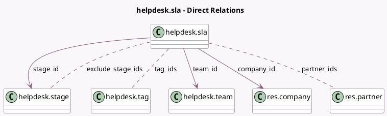

<!-- GENERATED:MODEL -->
---
tags: [odoo, enterprise, generated, model]
---

# helpdesk.sla

- Module: [[docs/Enterprise Addons/helpdesk/helpdesk|helpdesk]]
- Scope: Enterprise Addons
- Defined in module: yes
- Source files: `models/helpdesk_sla.py`
- Python classes: `HelpdeskSla`
- Description: Helpdesk SLA Policies

## Field footprint

- Detected fields: 12
- Field types: `Boolean` x 1, `Char` x 1, `Float` x 1, `Html` x 1, `Integer` x 1, `Many2many` x 3, `Many2one` x 3, `Selection` x 1
- Relation fields: 6

## Sample fields

- `active`: `Boolean` (comodel `Active`)
- `company_id`: `Many2one` (comodel `res.company`, related `team_id.company_id`, store `True`)
- `description`: `Html` (comodel `SLA Policy Description`)
- `exclude_stage_ids`: `Many2many` (comodel `helpdesk.stage`)
- `name`: `Char`
- `partner_ids`: `Many2many` (comodel `res.partner`)
- `priority`: `Selection`
- `stage_id`: `Many2one` (comodel `helpdesk.stage`)
- `tag_ids`: `Many2many` (comodel `helpdesk.tag`)
- `team_id`: `Many2one` (comodel `helpdesk.team`)
- `ticket_count`: `Integer` (compute `_compute_ticket_count`)
- `time`: `Float` (comodel `Within`)

## Method hints

- Detected methods: 5
- Action methods: `action_open_helpdesk_ticket`
- Compute methods: `_compute_display_name`, `_compute_ticket_count`
- Onchange methods: none

## Direct relation diagram

## Navigation

- **Parent:** [[docs/Enterprise Addons/helpdesk/Models]]

<!-- GENERATED:MODEL -->
