<!-- GENERATED:MODEL -->
---
tags: [odoo, enterprise, generated, model]
---

# helpdesk.sla.report.analysis

- Module: [[docs/Enterprise Addons/helpdesk/helpdesk|helpdesk]]
- Scope: Enterprise Addons
- Defined in module: yes
- Source files: `report/helpdesk_sla_report_analysis.py`
- Python classes: `HelpdeskSlaReportAnalysis`
- Description: SLA Status Analysis

## Field footprint

- Detected fields: 37
- Field types: `Boolean` x 5, `Char` x 5, `Datetime` x 3, `Float` x 5, `Integer` x 4, `Many2many` x 2, `Many2one` x 8, `One2many` x 1, `Selection` x 3, `Text` x 1
- Relation fields: 11

## Sample fields

- `active`: `Boolean` (comodel `Active`)
- `avg_response_hours`: `Float` (comodel `Average Hours to Respond`)
- `close_date`: `Datetime` (comodel `Closing Date`)
- `company_id`: `Many2one` (comodel `res.company`)
- `create_date`: `Datetime` (comodel `Ticket Creation Date`)
- `description`: `Text`
- `first_response_hours`: `Float` (comodel `Hours to First Response`)
- `kanban_state`: `Selection`
- `message_is_follower`: `Boolean` (related `ticket_id.message_is_follower`)
- `name`: `Char`
- `partner_email`: `Char`
- `partner_id`: `Many2one` (comodel `res.partner`)
- `partner_name`: `Char`
- `partner_phone`: `Char`
- `priority`: `Selection`
- `rating_avg`: `Float` (comodel `Average Rating`)
- `rating_last_value`: `Float` (comodel `Rating (1-5)`)
- `sla_deadline`: `Datetime` (comodel `SLA Deadline`)
- `sla_exceeded_hours`: `Integer` (comodel `Working Hours until SLA Deadline`)
- `sla_fail`: `Boolean` (comodel `SLA Status Failed`)

## Method hints

- Detected methods: 6
- Action methods: none
- Compute methods: none
- Onchange methods: none

## Direct relation diagram

```plantuml
@startuml
!define ODOO_COLOR_PRIMARY #714B67
!define ODOO_COLOR_ACCENT #875A7B
!define ODOO_COLOR_BG #FAF7FA

skinparam backgroundColor ODOO_COLOR_BG
skinparam defaultTextAlignment left
skinparam ArrowColor ODOO_COLOR_ACCENT
skinparam ClassBackgroundColor white
skinparam ClassBorderColor ODOO_COLOR_PRIMARY
skinparam ComponentBackgroundColor white
skinparam ComponentBorderColor ODOO_COLOR_PRIMARY
skinparam NoteBackgroundColor #FFF8FF
skinparam NoteBorderColor ODOO_COLOR_ACCENT
skinparam SequenceLifeLineBorderColor ODOO_COLOR_ACCENT
skinparam SequenceLifeLineBackgroundColor #FFFFFF
skinparam SequenceParticipantBorderColor ODOO_COLOR_PRIMARY
skinparam SequenceParticipantBackgroundColor #FFFFFF
skinparam sequence {
  ArrowColor ODOO_COLOR_ACCENT
  ActorBorderColor ODOO_COLOR_PRIMARY
}
title helpdesk.sla.report.analysis - Direct Relations
class "helpdesk.sla.report.analysis" as helpdesk_sla_report_analysis
class "helpdesk.sla" as helpdesk_sla
class "helpdesk.sla.status" as helpdesk_sla_status
class "helpdesk.stage" as helpdesk_stage
class "helpdesk.tag" as helpdesk_tag
class "helpdesk.team" as helpdesk_team
class "helpdesk.ticket" as helpdesk_ticket
class "res.company" as res_company
class "res.partner" as res_partner
class "res.users" as res_users
helpdesk_sla_report_analysis --> helpdesk_ticket : ticket_id
helpdesk_sla_report_analysis .. helpdesk_tag : tag_ids
helpdesk_sla_report_analysis --> res_users : user_id
helpdesk_sla_report_analysis --> res_partner : partner_id
helpdesk_sla_report_analysis --> helpdesk_stage : stage_id
helpdesk_sla_report_analysis --> helpdesk_sla : sla_id
helpdesk_sla_report_analysis .. helpdesk_sla : sla_ids
helpdesk_sla_report_analysis --|> helpdesk_sla_status : sla_status_ids
helpdesk_sla_report_analysis --> helpdesk_stage : sla_stage_id
helpdesk_sla_report_analysis --> helpdesk_team : team_id
helpdesk_sla_report_analysis --> res_company : company_id
@enduml
```

## Navigation

- **Parent:** [[docs/Enterprise Addons/helpdesk/Models]]

<!-- GENERATED:MODEL -->
