<!-- GENERATED:MODEL -->
---
tags: [odoo, enterprise, generated, model]
---

# helpdesk.sla.status

- Module: [[docs/Enterprise Addons/helpdesk/helpdesk|helpdesk]]
- Scope: Enterprise Addons
- Defined in module: yes
- Source files: `models/helpdesk_sla_status.py`
- Python classes: `HelpdeskSlaStatus`
- Description: Ticket SLA Status

## Field footprint

- Detected fields: 8
- Field types: `Datetime` x 2, `Float` x 1, `Integer` x 1, `Many2one` x 3, `Selection` x 1
- Relation fields: 3

## Sample fields

- `color`: `Integer` (comodel `Color Index`, compute `_compute_color`)
- `deadline`: `Datetime` (comodel `Deadline`, compute `_compute_deadline`, store `True`)
- `exceeded_hours`: `Float` (comodel `Exceeded Working Hours`, compute `_compute_exceeded_hours`, store `True`)
- `reached_datetime`: `Datetime` (comodel `Reached Date`)
- `sla_id`: `Many2one` (comodel `helpdesk.sla`)
- `sla_stage_id`: `Many2one` (comodel `helpdesk.stage`, related `sla_id.stage_id`, store `True`)
- `status`: `Selection` (compute `_compute_status`)
- `ticket_id`: `Many2one` (comodel `helpdesk.ticket`)

## Method hints

- Detected methods: 6
- Action methods: none
- Compute methods: `_compute_color`, `_compute_deadline`, `_compute_exceeded_hours`, `_compute_status`
- Onchange methods: none

## Direct relation diagram

```plantuml
@startuml
!define ODOO_COLOR_PRIMARY #714B67
!define ODOO_COLOR_ACCENT #875A7B
!define ODOO_COLOR_BG #FAF7FA

skinparam backgroundColor ODOO_COLOR_BG
skinparam defaultTextAlignment left
skinparam ArrowColor ODOO_COLOR_ACCENT
skinparam ClassBackgroundColor white
skinparam ClassBorderColor ODOO_COLOR_PRIMARY
skinparam ComponentBackgroundColor white
skinparam ComponentBorderColor ODOO_COLOR_PRIMARY
skinparam NoteBackgroundColor #FFF8FF
skinparam NoteBorderColor ODOO_COLOR_ACCENT
skinparam SequenceLifeLineBorderColor ODOO_COLOR_ACCENT
skinparam SequenceLifeLineBackgroundColor #FFFFFF
skinparam SequenceParticipantBorderColor ODOO_COLOR_PRIMARY
skinparam SequenceParticipantBackgroundColor #FFFFFF
skinparam sequence {
  ArrowColor ODOO_COLOR_ACCENT
  ActorBorderColor ODOO_COLOR_PRIMARY
}
title helpdesk.sla.status - Direct Relations
class "helpdesk.sla.status" as helpdesk_sla_status
class "helpdesk.sla" as helpdesk_sla
class "helpdesk.stage" as helpdesk_stage
class "helpdesk.ticket" as helpdesk_ticket
helpdesk_sla_status --> helpdesk_ticket : ticket_id
helpdesk_sla_status --> helpdesk_sla : sla_id
helpdesk_sla_status --> helpdesk_stage : sla_stage_id
@enduml
```

## Navigation

- **Parent:** [[docs/Enterprise Addons/helpdesk/Models]]

<!-- GENERATED:MODEL -->
