<!-- GENERATED:MODEL -->
---
tags: [odoo, enterprise, generated, model]
---

# helpdesk.stage.delete.wizard

- Module: [[docs/Enterprise Addons/helpdesk/helpdesk|helpdesk]]
- Scope: Enterprise Addons
- Defined in module: yes
- Source files: `wizard/helpdesk_stage_delete.py`
- Python classes: `HelpdeskStageDeleteWizard`
- Description: Helpdesk Stage Delete Wizard

## Field footprint

- Detected fields: 4
- Field types: `Boolean` x 1, `Integer` x 1, `Many2many` x 2
- Relation fields: 2

## Sample fields

- `stage_ids`: `Many2many` (comodel `helpdesk.stage`)
- `stages_active`: `Boolean` (compute `_compute_stages_active`)
- `team_ids`: `Many2many` (comodel `helpdesk.team`)
- `ticket_count`: `Integer` (comodel `Number of Tickets`, compute `_compute_ticket_count`)

## Method hints

- Detected methods: 7
- Action methods: `action_archive`, `action_confirm`, `action_unarchive_ticket`, `action_unlink`
- Compute methods: `_compute_stages_active`, `_compute_ticket_count`
- Onchange methods: none

## Direct relation diagram

```plantuml
@startuml
!define ODOO_COLOR_PRIMARY #714B67
!define ODOO_COLOR_ACCENT #875A7B
!define ODOO_COLOR_BG #FAF7FA

skinparam backgroundColor ODOO_COLOR_BG
skinparam defaultTextAlignment left
skinparam ArrowColor ODOO_COLOR_ACCENT
skinparam ClassBackgroundColor white
skinparam ClassBorderColor ODOO_COLOR_PRIMARY
skinparam ComponentBackgroundColor white
skinparam ComponentBorderColor ODOO_COLOR_PRIMARY
skinparam NoteBackgroundColor #FFF8FF
skinparam NoteBorderColor ODOO_COLOR_ACCENT
skinparam SequenceLifeLineBorderColor ODOO_COLOR_ACCENT
skinparam SequenceLifeLineBackgroundColor #FFFFFF
skinparam SequenceParticipantBorderColor ODOO_COLOR_PRIMARY
skinparam SequenceParticipantBackgroundColor #FFFFFF
skinparam sequence {
  ArrowColor ODOO_COLOR_ACCENT
  ActorBorderColor ODOO_COLOR_PRIMARY
}
title helpdesk.stage.delete.wizard - Direct Relations
class "helpdesk.stage.delete.wizard" as helpdesk_stage_delete_wizard
class "helpdesk.stage" as helpdesk_stage
class "helpdesk.team" as helpdesk_team
helpdesk_stage_delete_wizard .. helpdesk_team : team_ids
helpdesk_stage_delete_wizard .. helpdesk_stage : stage_ids
@enduml
```

## Navigation

- **Parent:** [[docs/Enterprise Addons/helpdesk/Models]]

<!-- GENERATED:MODEL -->
