<!-- GENERATED:MODEL -->
---
tags: [odoo, enterprise, generated, model]
---

# helpdesk.stage

- Module: [[docs/Enterprise Addons/helpdesk/helpdesk|helpdesk]]
- Scope: Enterprise Addons
- Defined in module: yes
- Source files: `models/helpdesk_stage.py`
- Python classes: `HelpdeskStage`
- Description: Helpdesk Stage

## Field footprint

- Detected fields: 13
- Field types: `Boolean` x 2, `Char` x 4, `Integer` x 4, `Many2many` x 1, `Many2one` x 1, `Text` x 1
- Relation fields: 2

## Sample fields

- `active`: `Boolean`
- `color`: `Integer`
- `description`: `Text`
- `fold`: `Boolean` (comodel `Folded`)
- `legend_blocked`: `Char` (comodel `Red Kanban Label`)
- `legend_done`: `Char` (comodel `Green Kanban Label`)
- `legend_normal`: `Char` (comodel `Grey Kanban Label`)
- `name`: `Char`
- `rotting_threshold_days`: `Integer` (comodel `Days to rot`)
- `sequence`: `Integer`
- `team_ids`: `Many2many` (comodel `helpdesk.team`)
- `template_id`: `Many2one` (comodel `mail.template`)
- `ticket_count`: `Integer` (compute `_compute_ticket_count`)

## Method hints

- Detected methods: 6
- Action methods: `action_open_helpdesk_ticket`, `action_unarchive`, `action_unlink_wizard`
- Compute methods: `_compute_ticket_count`
- Onchange methods: none

## Direct relation diagram

```plantuml
@startuml
!define ODOO_COLOR_PRIMARY #714B67
!define ODOO_COLOR_ACCENT #875A7B
!define ODOO_COLOR_BG #FAF7FA

skinparam backgroundColor ODOO_COLOR_BG
skinparam defaultTextAlignment left
skinparam ArrowColor ODOO_COLOR_ACCENT
skinparam ClassBackgroundColor white
skinparam ClassBorderColor ODOO_COLOR_PRIMARY
skinparam ComponentBackgroundColor white
skinparam ComponentBorderColor ODOO_COLOR_PRIMARY
skinparam NoteBackgroundColor #FFF8FF
skinparam NoteBorderColor ODOO_COLOR_ACCENT
skinparam SequenceLifeLineBorderColor ODOO_COLOR_ACCENT
skinparam SequenceLifeLineBackgroundColor #FFFFFF
skinparam SequenceParticipantBorderColor ODOO_COLOR_PRIMARY
skinparam SequenceParticipantBackgroundColor #FFFFFF
skinparam sequence {
  ArrowColor ODOO_COLOR_ACCENT
  ActorBorderColor ODOO_COLOR_PRIMARY
}
title helpdesk.stage - Direct Relations
class "helpdesk.stage" as helpdesk_stage
class "helpdesk.team" as helpdesk_team
class "mail.template" as mail_template
helpdesk_stage .. helpdesk_team : team_ids
helpdesk_stage --> mail_template : template_id
@enduml
```

## Navigation

- **Parent:** [[docs/Enterprise Addons/helpdesk/Models]]

<!-- GENERATED:MODEL -->
