<!-- GENERATED:MODEL -->
---
tags: [odoo, enterprise, generated, model]
---

# helpdesk.tag.assignment

- Module: [[docs/Enterprise Addons/helpdesk/helpdesk|helpdesk]]
- Scope: Enterprise Addons
- Defined in module: yes
- Source files: `models/helpdesk_tag_assignment.py`
- Python classes: `HelpdeskTagAssignment`
- Description: Helpdesk Tag Assignment

## Field footprint

- Detected fields: 3
- Field types: `Many2many` x 1, `Many2one` x 2
- Relation fields: 3

## Sample fields

- `tag_id`: `Many2one` (comodel `helpdesk.tag`)
- `team_id`: `Many2one` (comodel `helpdesk.team`)
- `user_ids`: `Many2many` (comodel `res.users`)

## Method hints

- Detected methods: 0
- Action methods: none
- Compute methods: none
- Onchange methods: none

## Direct relation diagram

```plantuml
@startuml
!define ODOO_COLOR_PRIMARY #714B67
!define ODOO_COLOR_ACCENT #875A7B
!define ODOO_COLOR_BG #FAF7FA

skinparam backgroundColor ODOO_COLOR_BG
skinparam defaultTextAlignment left
skinparam ArrowColor ODOO_COLOR_ACCENT
skinparam ClassBackgroundColor white
skinparam ClassBorderColor ODOO_COLOR_PRIMARY
skinparam ComponentBackgroundColor white
skinparam ComponentBorderColor ODOO_COLOR_PRIMARY
skinparam NoteBackgroundColor #FFF8FF
skinparam NoteBorderColor ODOO_COLOR_ACCENT
skinparam SequenceLifeLineBorderColor ODOO_COLOR_ACCENT
skinparam SequenceLifeLineBackgroundColor #FFFFFF
skinparam SequenceParticipantBorderColor ODOO_COLOR_PRIMARY
skinparam SequenceParticipantBackgroundColor #FFFFFF
skinparam sequence {
  ArrowColor ODOO_COLOR_ACCENT
  ActorBorderColor ODOO_COLOR_PRIMARY
}
title helpdesk.tag.assignment - Direct Relations
class "helpdesk.tag.assignment" as helpdesk_tag_assignment
class "helpdesk.tag" as helpdesk_tag
class "helpdesk.team" as helpdesk_team
class "res.users" as res_users
helpdesk_tag_assignment --> helpdesk_team : team_id
helpdesk_tag_assignment --> helpdesk_tag : tag_id
helpdesk_tag_assignment .. res_users : user_ids
@enduml
```

## Navigation

- **Parent:** [[docs/Enterprise Addons/helpdesk/Models]]

<!-- GENERATED:MODEL -->
