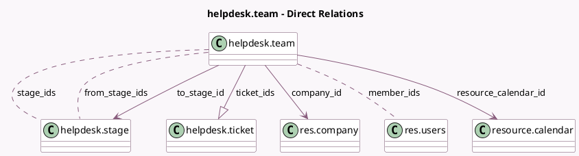

<!-- GENERATED:MODEL -->
---
tags: [odoo, enterprise, generated, model]
---

# helpdesk.team

- Module: [[docs/Enterprise Addons/helpdesk/helpdesk|helpdesk]]
- Scope: Enterprise Addons
- Defined in module: yes
- Source files: `models/helpdesk_team.py`
- Python classes: `HelpdeskTeam`
- Description: Helpdesk Team
- Inherits: `mail.alias.mixin`, `mail.thread`, `rating.parent.mixin`

## Field footprint

- Detected fields: 49
- Field types: `Boolean` x 24, `Char` x 4, `Float` x 1, `Html` x 1, `Integer` x 9, `Many2many` x 3, `Many2one` x 3, `One2many` x 1, `PropertiesDefinition` x 1, `Selection` x 2
- Relation fields: 7

## Sample fields

- `access_instruction_message`: `Char` (compute `_compute_access_instruction_message`)
- `active`: `Boolean`
- `alias_email_from`: `Char` (compute `_compute_alias_email_from`)
- `allow_portal_ticket_closing`: `Boolean` (comodel `Closure by Customers`)
- `assign_method`: `Selection`
- `auto_assignment`: `Boolean` (comodel `Automatic Assignment`)
- `auto_close_day`: `Integer` (comodel `Inactive Period(days)`)
- `auto_close_ticket`: `Boolean` (comodel `Automatic Closing`)
- `color`: `Integer` (comodel `Color Index`)
- `company_id`: `Many2one` (comodel `res.company`)
- `description`: `Html` (comodel `About Team`)
- `from_stage_ids`: `Many2many` (comodel `helpdesk.stage`)
- `has_external_mail_server`: `Boolean` (compute `_compute_has_external_mail_server`)
- `member_ids`: `Many2many` (comodel `res.users`)
- `name`: `Char` (comodel `Helpdesk Team`)
- `open_ticket_count`: `Integer` (comodel `# Open Tickets`, compute `_compute_open_ticket_count`)
- `privacy_visibility`: `Selection`
- `privacy_visibility_warning`: `Char` (compute `_compute_privacy_visibility_warning`)
- `resource_calendar_id`: `Many2one` (comodel `resource.calendar`)
- `sequence`: `Integer`

## Method hints

- Detected methods: 67
- Action methods: `action_view_closed_ticket`, `action_view_customer_satisfaction`, `action_view_open_ticket`, `action_view_open_ticket_view`, `action_view_rating_7days`, `action_view_rating_today`, `action_view_sla_failed`, `action_view_sla_policy`, and 4 more
- Compute methods: `_compute_access_instruction_message`, `_compute_alias_email_from`, `_compute_assign_stage_id`, `_compute_display_name`, `_compute_has_external_mail_server`, `_compute_open_ticket_count`, `_compute_privacy_visibility_warning`, `_compute_show_knowledge_base`, and 12 more
- Onchange methods: `_onchange_assign_method`, `_onchange_use_alias`

## Direct relation diagram

## Navigation

- **Parent:** [[docs/Enterprise Addons/helpdesk/Models]]

<!-- GENERATED:MODEL -->
