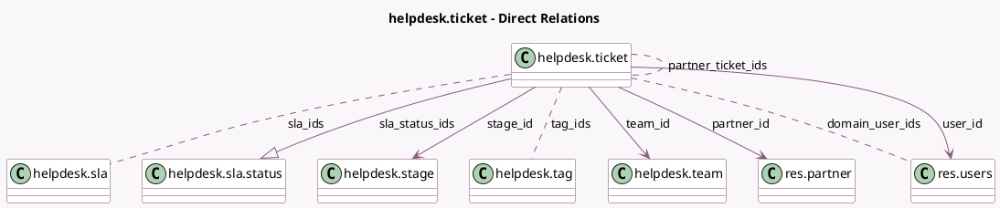

<!-- GENERATED:MODEL -->
---
tags: [odoo, enterprise, generated, model]
---

# helpdesk.ticket

- Module: [[docs/Enterprise Addons/helpdesk/helpdesk|helpdesk]]
- Scope: Enterprise Addons
- Defined in module: yes
- Source files: `models/helpdesk_ticket.py`
- Python classes: `HelpdeskTicket`
- Description: Helpdesk Ticket
- Inherits: `mail.activity.mixin`, `mail.thread.cc`, `mail.tracking.duration.mixin`, `portal.mixin`, `rating.mixin`, `utm.mixin`

## Field footprint

- Detected fields: 61
- Field types: `Boolean` x 18, `Char` x 9, `Datetime` x 5, `Float` x 6, `Html` x 1, `Integer` x 6, `Many2many` x 4, `Many2one` x 6, `One2many` x 2, `Properties` x 1, `Selection` x 3
- Relation fields: 12

## Sample fields

- `active`: `Boolean`
- `answered_customer_message_count`: `Integer` (comodel `# Exchanges`)
- `assign_date`: `Datetime` (comodel `First assignment date`)
- `assign_hours`: `Float` (comodel `Time to first assignment (hours)`, compute `_compute_assign_hours`, store `True`)
- `avg_response_hours`: `Float` (comodel `Average Hours to Respond`)
- `close_date`: `Datetime` (comodel `Close date`)
- `close_hours`: `Float` (comodel `Time to close (hours)`, compute `_compute_close_hours`, store `True`)
- `closed_by_partner`: `Boolean` (comodel `Closed by Partner`)
- `color`: `Integer`
- `commercial_partner_id`: `Many2one` (related `partner_id.commercial_partner_id`)
- `company_id`: `Many2one` (related `team_id.company_id`, store `True`)
- `date_last_stage_update`: `Datetime` (comodel `Last Stage Update`)
- `description`: `Html`
- `display_extra_info`: `Boolean` (compute `_compute_display_extra_info`)
- `domain_user_ids`: `Many2many` (comodel `res.users`, compute `_compute_domain_user_ids`)
- `first_response_hours`: `Float` (comodel `Hours to First Response`)
- `fold`: `Boolean` (related `stage_id.fold`)
- `is_partner_email_update`: `Boolean` (compute `_compute_is_partner_email_update`)
- `is_partner_phone_update`: `Boolean` (compute `_compute_is_partner_phone_update`)
- `kanban_state`: `Selection`

## Method hints

- Detected methods: 65
- Action methods: `action_customer_preview`, `action_open_helpdesk_ticket`, `action_open_ratings`
- Compute methods: `_compute_access_url`, `_compute_assign_hours`, `_compute_close_hours`, `_compute_display_extra_info`, `_compute_display_name`, `_compute_domain_user_ids`, `_compute_is_partner_email_update`, `_compute_is_partner_phone_update`, and 12 more
- Onchange methods: none

## Direct relation diagram

## Navigation

- **Parent:** [[docs/Enterprise Addons/helpdesk/Models]]

<!-- GENERATED:MODEL -->
