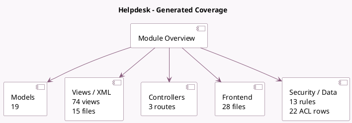

<!-- GENERATED:MODULE -->
---
tags: [odoo, enterprise, module]
---

# Helpdesk

- Scope: Enterprise Addons
- Source: enterprise/helpdesk
- Dependencies: [[docs/Community Addons/base_setup/base_setup|base_setup]], [[docs/Community Addons/mail/mail|mail]], [[docs/Community Addons/utm/utm|utm]], [[docs/Community Addons/rating/rating|rating]], [[docs/Community Addons/web_tour/web_tour|web_tour]], [[docs/Enterprise Addons/web_cohort/web_cohort|web_cohort]], [[docs/Community Addons/resource/resource|resource]], [[docs/Community Addons/portal/portal|portal]], [[docs/Community Addons/digest/digest|digest]]

## Summary

Track, prioritize, and solve customer tickets

## Generated coverage

- Models: 19
- XML files with UI/data artifacts: 15
- Views: 74
- Actions: 97
- Menus: 16
- Rules (ir.rule): 13
- Access CSV entries: 22
- Controller units: 1
- Frontend asset files: 28

## Module map

## Detail notes

- Models: [[docs/Enterprise Addons/helpdesk/Models|Models]] (19)
- Views and XML: [[docs/Enterprise Addons/helpdesk/Views|Views]] (15 files)
- Controllers: [[docs/Enterprise Addons/helpdesk/Controllers|Controllers]] (1)
- Frontend: [[docs/Enterprise Addons/helpdesk/Frontend|Frontend]] (28 files)

## Key models

- `digest.digest`
- `helpdesk.sla`
- `helpdesk.sla.report.analysis`
- `helpdesk.sla.status`
- `helpdesk.stage`
- `helpdesk.stage.delete.wizard`
- `helpdesk.tag`
- `helpdesk.tag.assignment`
- `helpdesk.team`
- `helpdesk.ticket`
- `helpdesk.ticket.report.analysis`
- `ir.module.module`

## Navigation

- [[../Enterprise Addons/Enterprise Addons|Back to scope]]
- [[../../docs/docs|Back to docs]]

<!-- GENERATED:MODULE -->

