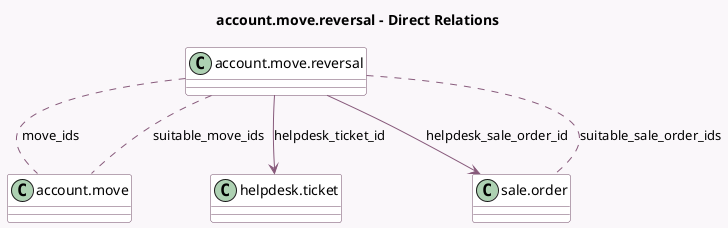

<!-- GENERATED:MODEL -->
---
tags: [odoo, enterprise, generated, model]
---

# account.move.reversal

- Module: [[docs/Enterprise Addons/helpdesk_account/helpdesk_account|helpdesk_account]]
- Scope: Enterprise Addons
- Defined in module: extension only
- Source files: `wizard/account_move_reversal.py`
- Python classes: `AccountMoveReversal`

## Field footprint

- Detected fields: 5
- Field types: `Many2many` x 3, `Many2one` x 2
- Relation fields: 5

## Sample fields

- `helpdesk_sale_order_id`: `Many2one` (comodel `sale.order`)
- `helpdesk_ticket_id`: `Many2one` (comodel `helpdesk.ticket`)
- `move_ids`: `Many2many` (comodel `account.move`, compute `_compute_move_ids`, store `True`)
- `suitable_move_ids`: `Many2many` (comodel `account.move`, compute `_compute_suitable_moves`)
- `suitable_sale_order_ids`: `Many2many` (comodel `sale.order`, compute `_compute_suitable_sale_orders`)

## Method hints

- Detected methods: 12
- Action methods: none
- Compute methods: `_compute_journal_id`, `_compute_move_ids`, `_compute_suitable_moves`, `_compute_suitable_sale_orders`
- Onchange methods: none

## Direct relation diagram

## Navigation

- **Parent:** [[docs/Enterprise Addons/helpdesk_account/Models]]

<!-- GENERATED:MODEL -->
