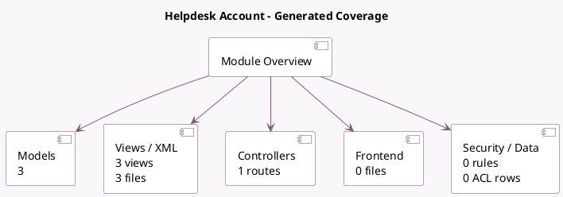

<!-- GENERATED:MODULE -->
---
tags: [odoo, enterprise, module]
---

# Helpdesk Account

- Scope: Enterprise Addons
- Source: enterprise/helpdesk_account
- Dependencies: [[docs/Enterprise Addons/helpdesk_sale/helpdesk_sale|helpdesk_sale]], [[docs/Community Addons/account/account|account]]

## Summary

Project, Tasks, Account

## Generated coverage

- Models: 3
- XML files with UI/data artifacts: 3
- Views: 3
- Actions: 2
- Menus: 0
- Rules (ir.rule): 0
- Access CSV entries: 0
- Controller units: 1
- Frontend asset files: 0

## Module map

## Detail notes

- Models: [[docs/Enterprise Addons/helpdesk_account/Models|Models]] (3)
- Views and XML: [[docs/Enterprise Addons/helpdesk_account/Views|Views]] (3 files)
- Controllers: [[docs/Enterprise Addons/helpdesk_account/Controllers|Controllers]] (1)

## Key models

- `account.move`
- `account.move.reversal`
- `helpdesk.ticket`

## Navigation

- [[../Enterprise Addons/Enterprise Addons|Back to scope]]
- [[../../docs/docs|Back to docs]]

<!-- GENERATED:MODULE -->

