<!-- GENERATED:MODEL -->
---
tags: [odoo, enterprise, generated, model]
---

# helpdesk.create.fsm.task

- Module: [[docs/Enterprise Addons/helpdesk_fsm/helpdesk_fsm|helpdesk_fsm]]
- Scope: Enterprise Addons
- Defined in module: yes
- Source files: `wizard/create_task.py`
- Python classes: `HelpdeskCreateFsmTask`
- Description: Create a Field Service task

## Field footprint

- Detected fields: 5
- Field types: `Char` x 1, `Many2one` x 4
- Relation fields: 4

## Sample fields

- `company_id`: `Many2one` (related `helpdesk_ticket_id.company_id`)
- `helpdesk_ticket_id`: `Many2one` (comodel `helpdesk.ticket`)
- `name`: `Char` (comodel `Title`)
- `partner_id`: `Many2one` (comodel `res.partner`)
- `project_id`: `Many2one` (comodel `project.project`)

## Method hints

- Detected methods: 4
- Action methods: `action_generate_and_view_task`, `action_generate_task`
- Compute methods: none
- Onchange methods: none

## Direct relation diagram

```plantuml
@startuml
!define ODOO_COLOR_PRIMARY #714B67
!define ODOO_COLOR_ACCENT #875A7B
!define ODOO_COLOR_BG #FAF7FA

skinparam backgroundColor ODOO_COLOR_BG
skinparam defaultTextAlignment left
skinparam ArrowColor ODOO_COLOR_ACCENT
skinparam ClassBackgroundColor white
skinparam ClassBorderColor ODOO_COLOR_PRIMARY
skinparam ComponentBackgroundColor white
skinparam ComponentBorderColor ODOO_COLOR_PRIMARY
skinparam NoteBackgroundColor #FFF8FF
skinparam NoteBorderColor ODOO_COLOR_ACCENT
skinparam SequenceLifeLineBorderColor ODOO_COLOR_ACCENT
skinparam SequenceLifeLineBackgroundColor #FFFFFF
skinparam SequenceParticipantBorderColor ODOO_COLOR_PRIMARY
skinparam SequenceParticipantBackgroundColor #FFFFFF
skinparam sequence {
  ArrowColor ODOO_COLOR_ACCENT
  ActorBorderColor ODOO_COLOR_PRIMARY
}
title helpdesk.create.fsm.task - Direct Relations
class "helpdesk.create.fsm.task" as helpdesk_create_fsm_task
class "helpdesk.ticket" as helpdesk_ticket
class "project.project" as project_project
class "res.partner" as res_partner
helpdesk_create_fsm_task --> helpdesk_ticket : helpdesk_ticket_id
helpdesk_create_fsm_task --> project_project : project_id
helpdesk_create_fsm_task --> res_partner : partner_id
@enduml
```

## Navigation

- **Parent:** [[docs/Enterprise Addons/helpdesk_fsm/Models]]

<!-- GENERATED:MODEL -->
