<!-- GENERATED:MODEL -->
---
tags: [odoo, enterprise, generated, model]
---

# helpdesk.team

- Module: [[docs/Enterprise Addons/helpdesk_fsm/helpdesk_fsm|helpdesk_fsm]]
- Scope: Enterprise Addons
- Defined in module: extension only
- Source files: `models/helpdesk_team.py`
- Python classes: `HelpdeskTeam`

## Field footprint

- Detected fields: 1
- Field types: `Many2one` x 1
- Relation fields: 1

## Sample fields

- `fsm_project_id`: `Many2one` (comodel `project.project`, compute `_compute_fsm_project_id`, store `True`)

## Method hints

- Detected methods: 2
- Action methods: none
- Compute methods: `_compute_fsm_project_id`
- Onchange methods: none

## Direct relation diagram

```plantuml
@startuml
!define ODOO_COLOR_PRIMARY #714B67
!define ODOO_COLOR_ACCENT #875A7B
!define ODOO_COLOR_BG #FAF7FA

skinparam backgroundColor ODOO_COLOR_BG
skinparam defaultTextAlignment left
skinparam ArrowColor ODOO_COLOR_ACCENT
skinparam ClassBackgroundColor white
skinparam ClassBorderColor ODOO_COLOR_PRIMARY
skinparam ComponentBackgroundColor white
skinparam ComponentBorderColor ODOO_COLOR_PRIMARY
skinparam NoteBackgroundColor #FFF8FF
skinparam NoteBorderColor ODOO_COLOR_ACCENT
skinparam SequenceLifeLineBorderColor ODOO_COLOR_ACCENT
skinparam SequenceLifeLineBackgroundColor #FFFFFF
skinparam SequenceParticipantBorderColor ODOO_COLOR_PRIMARY
skinparam SequenceParticipantBackgroundColor #FFFFFF
skinparam sequence {
  ArrowColor ODOO_COLOR_ACCENT
  ActorBorderColor ODOO_COLOR_PRIMARY
}
title helpdesk.team - Direct Relations
class "helpdesk.team" as helpdesk_team
class "project.project" as project_project
helpdesk_team --> project_project : fsm_project_id
@enduml
```

## Navigation

- **Parent:** [[docs/Enterprise Addons/helpdesk_fsm/Models]]

<!-- GENERATED:MODEL -->
