<!-- GENERATED:MODEL -->
---
tags: [odoo, enterprise, generated, model]
---

# helpdesk.ticket

- Module: [[docs/Enterprise Addons/helpdesk_fsm/helpdesk_fsm|helpdesk_fsm]]
- Scope: Enterprise Addons
- Defined in module: extension only
- Source files: `models/helpdesk_ticket.py`
- Python classes: `HelpdeskTicket`

## Field footprint

- Detected fields: 3
- Field types: `Boolean` x 1, `Integer` x 1, `One2many` x 1
- Relation fields: 1

## Sample fields

- `fsm_task_count`: `Integer` (compute `_compute_fsm_task_count`)
- `fsm_task_ids`: `One2many` (comodel `project.task`)
- `use_fsm`: `Boolean` (related `team_id.use_fsm`)

## Method hints

- Detected methods: 4
- Action methods: `action_generate_fsm_task`, `action_view_fsm_tasks`
- Compute methods: `_compute_fsm_task_count`
- Onchange methods: none

## Direct relation diagram

```plantuml
@startuml
!define ODOO_COLOR_PRIMARY #714B67
!define ODOO_COLOR_ACCENT #875A7B
!define ODOO_COLOR_BG #FAF7FA

skinparam backgroundColor ODOO_COLOR_BG
skinparam defaultTextAlignment left
skinparam ArrowColor ODOO_COLOR_ACCENT
skinparam ClassBackgroundColor white
skinparam ClassBorderColor ODOO_COLOR_PRIMARY
skinparam ComponentBackgroundColor white
skinparam ComponentBorderColor ODOO_COLOR_PRIMARY
skinparam NoteBackgroundColor #FFF8FF
skinparam NoteBorderColor ODOO_COLOR_ACCENT
skinparam SequenceLifeLineBorderColor ODOO_COLOR_ACCENT
skinparam SequenceLifeLineBackgroundColor #FFFFFF
skinparam SequenceParticipantBorderColor ODOO_COLOR_PRIMARY
skinparam SequenceParticipantBackgroundColor #FFFFFF
skinparam sequence {
  ArrowColor ODOO_COLOR_ACCENT
  ActorBorderColor ODOO_COLOR_PRIMARY
}
title helpdesk.ticket - Direct Relations
class "helpdesk.ticket" as helpdesk_ticket
class "project.task" as project_task
helpdesk_ticket --|> project_task : fsm_task_ids
@enduml
```

## Navigation

- **Parent:** [[docs/Enterprise Addons/helpdesk_fsm/Models]]

<!-- GENERATED:MODEL -->
