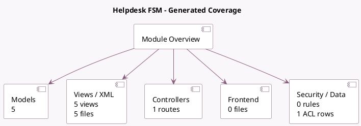

<!-- GENERATED:MODULE -->
---
tags: [odoo, enterprise, module]
---

# Helpdesk FSM

- Scope: Enterprise Addons
- Source: enterprise/helpdesk_fsm
- Dependencies: [[docs/Enterprise Addons/project_helpdesk/project_helpdesk|project_helpdesk]], [[docs/Enterprise Addons/industry_fsm/industry_fsm|industry_fsm]]

## Summary

Allow generating fsm tasks from ticket

## Generated coverage

- Models: 5
- XML files with UI/data artifacts: 5
- Views: 5
- Actions: 0
- Menus: 0
- Rules (ir.rule): 0
- Access CSV entries: 1
- Controller units: 1
- Frontend asset files: 0

## Module map

## Detail notes

- Models: [[docs/Enterprise Addons/helpdesk_fsm/Models|Models]] (5)
- Views and XML: [[docs/Enterprise Addons/helpdesk_fsm/Views|Views]] (5 files)
- Controllers: [[docs/Enterprise Addons/helpdesk_fsm/Controllers|Controllers]] (1)

## Key models

- `helpdesk.create.fsm.task`
- `helpdesk.team`
- `helpdesk.ticket`
- `helpdesk.ticket.convert.wizard`
- `project.task`

## Navigation

- [[../Enterprise Addons/Enterprise Addons|Back to scope]]
- [[../../docs/docs|Back to docs]]

<!-- GENERATED:MODULE -->

