<!-- GENERATED:MODEL -->
---
tags: [odoo, enterprise, generated, model]
---

# helpdesk.create.fsm.task

- Module: [[docs/Enterprise Addons/helpdesk_fsm_report/helpdesk_fsm_report|helpdesk_fsm_report]]
- Scope: Enterprise Addons
- Defined in module: extension only
- Source files: `wizard/create_task.py`
- Python classes: `HelpdeskCreateFsmTask`

## Field footprint

- Detected fields: 2
- Field types: `Boolean` x 1, `Many2one` x 1
- Relation fields: 1

## Sample fields

- `allow_worksheets`: `Boolean` (related `project_id.allow_worksheets`)
- `worksheet_template_id`: `Many2one` (comodel `worksheet.template`, compute `_compute_worksheet_template_id`, store `True`)

## Method hints

- Detected methods: 3
- Action methods: none
- Compute methods: `_compute_worksheet_template_id`
- Onchange methods: none

## Direct relation diagram

```plantuml
@startuml
!define ODOO_COLOR_PRIMARY #714B67
!define ODOO_COLOR_ACCENT #875A7B
!define ODOO_COLOR_BG #FAF7FA

skinparam backgroundColor ODOO_COLOR_BG
skinparam defaultTextAlignment left
skinparam ArrowColor ODOO_COLOR_ACCENT
skinparam ClassBackgroundColor white
skinparam ClassBorderColor ODOO_COLOR_PRIMARY
skinparam ComponentBackgroundColor white
skinparam ComponentBorderColor ODOO_COLOR_PRIMARY
skinparam NoteBackgroundColor #FFF8FF
skinparam NoteBorderColor ODOO_COLOR_ACCENT
skinparam SequenceLifeLineBorderColor ODOO_COLOR_ACCENT
skinparam SequenceLifeLineBackgroundColor #FFFFFF
skinparam SequenceParticipantBorderColor ODOO_COLOR_PRIMARY
skinparam SequenceParticipantBackgroundColor #FFFFFF
skinparam sequence {
  ArrowColor ODOO_COLOR_ACCENT
  ActorBorderColor ODOO_COLOR_PRIMARY
}
title helpdesk.create.fsm.task - Direct Relations
class "helpdesk.create.fsm.task" as helpdesk_create_fsm_task
class "worksheet.template" as worksheet_template
helpdesk_create_fsm_task --> worksheet_template : worksheet_template_id
@enduml
```

## Navigation

- **Parent:** [[docs/Enterprise Addons/helpdesk_fsm_report/Models]]

<!-- GENERATED:MODEL -->
