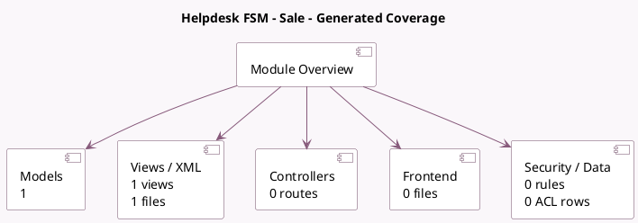

<!-- GENERATED:MODULE -->
---
tags: [odoo, enterprise, module]
---

# Helpdesk FSM - Sale

- Scope: Enterprise Addons
- Source: enterprise/helpdesk_fsm_sale
- Dependencies: [[docs/Enterprise Addons/helpdesk_fsm/helpdesk_fsm|helpdesk_fsm]], [[docs/Enterprise Addons/helpdesk_sale_timesheet/helpdesk_sale_timesheet|helpdesk_sale_timesheet]], [[docs/Enterprise Addons/industry_fsm_sale/industry_fsm_sale|industry_fsm_sale]]

## Summary

Project, Helpdesk, FSM, Timesheet and Sale Orders

## Generated coverage

- Models: 1
- XML files with UI/data artifacts: 1
- Views: 1
- Actions: 0
- Menus: 0
- Rules (ir.rule): 0
- Access CSV entries: 0
- Controller units: 0
- Frontend asset files: 0

## Module map

## Detail notes

- Models: [[docs/Enterprise Addons/helpdesk_fsm_sale/Models|Models]] (1)
- Views and XML: [[docs/Enterprise Addons/helpdesk_fsm_sale/Views|Views]] (1 files)

## Key models

- `helpdesk.create.fsm.task`

## Navigation

- [[../Enterprise Addons/Enterprise Addons|Back to scope]]
- [[../../docs/docs|Back to docs]]

<!-- GENERATED:MODULE -->

