<!-- GENERATED:MODEL -->
---
tags: [odoo, enterprise, generated, model]
---

# helpdesk.sale.coupon.generate

- Module: [[docs/Enterprise Addons/helpdesk_sale_loyalty/helpdesk_sale_loyalty|helpdesk_sale_loyalty]]
- Scope: Enterprise Addons
- Defined in module: yes
- Source files: `wizard/helpdesk_sale_coupon_generate.py`
- Python classes: `HelpdeskSaleCouponGenerate`
- Description: Generate Sales Coupon from Helpdesk

## Field footprint

- Detected fields: 6
- Field types: `Char` x 1, `Date` x 1, `Float` x 1, `Many2one` x 3
- Relation fields: 3

## Sample fields

- `company_id`: `Many2one` (related `ticket_id.company_id`)
- `points_granted`: `Float` (comodel `Coupon Value`)
- `points_name`: `Char` (related `program.portal_point_name`)
- `program`: `Many2one` (comodel `loyalty.program`)
- `ticket_id`: `Many2one` (comodel `helpdesk.ticket`)
- `valid_until`: `Date` (comodel `Valid Until`)

## Method hints

- Detected methods: 3
- Action methods: `action_coupon_generate_send`
- Compute methods: none
- Onchange methods: none

## Direct relation diagram

```plantuml
@startuml
!define ODOO_COLOR_PRIMARY #714B67
!define ODOO_COLOR_ACCENT #875A7B
!define ODOO_COLOR_BG #FAF7FA

skinparam backgroundColor ODOO_COLOR_BG
skinparam defaultTextAlignment left
skinparam ArrowColor ODOO_COLOR_ACCENT
skinparam ClassBackgroundColor white
skinparam ClassBorderColor ODOO_COLOR_PRIMARY
skinparam ComponentBackgroundColor white
skinparam ComponentBorderColor ODOO_COLOR_PRIMARY
skinparam NoteBackgroundColor #FFF8FF
skinparam NoteBorderColor ODOO_COLOR_ACCENT
skinparam SequenceLifeLineBorderColor ODOO_COLOR_ACCENT
skinparam SequenceLifeLineBackgroundColor #FFFFFF
skinparam SequenceParticipantBorderColor ODOO_COLOR_PRIMARY
skinparam SequenceParticipantBackgroundColor #FFFFFF
skinparam sequence {
  ArrowColor ODOO_COLOR_ACCENT
  ActorBorderColor ODOO_COLOR_PRIMARY
}
title helpdesk.sale.coupon.generate - Direct Relations
class "helpdesk.sale.coupon.generate" as helpdesk_sale_coupon_generate
class "helpdesk.ticket" as helpdesk_ticket
class "loyalty.program" as loyalty_program
helpdesk_sale_coupon_generate --> helpdesk_ticket : ticket_id
helpdesk_sale_coupon_generate --> loyalty_program : program
@enduml
```

## Navigation

- **Parent:** [[docs/Enterprise Addons/helpdesk_sale_loyalty/Models]]

<!-- GENERATED:MODEL -->
