<!-- GENERATED:MODEL -->
---
tags: [odoo, enterprise, generated, model]
---

# helpdesk.ticket

- Module: [[docs/Enterprise Addons/helpdesk_sale_loyalty/helpdesk_sale_loyalty|helpdesk_sale_loyalty]]
- Scope: Enterprise Addons
- Defined in module: extension only
- Source files: `models/helpdesk_ticket.py`
- Python classes: `HelpdeskTicket`

## Field footprint

- Detected fields: 4
- Field types: `Integer` x 2, `Many2many` x 1, `Many2one` x 1
- Relation fields: 2

## Sample fields

- `coupon_ids`: `Many2many` (comodel `loyalty.card`)
- `coupons_count`: `Integer` (compute `_compute_coupons_count`)
- `default_giftcard_program_id`: `Many2one` (comodel `loyalty.program`)
- `gift_card_count`: `Integer` (compute `_compute_coupons_count`)

## Method hints

- Detected methods: 2
- Action methods: none
- Compute methods: `_compute_coupons_count`
- Onchange methods: none

## Direct relation diagram

```plantuml
@startuml
!define ODOO_COLOR_PRIMARY #714B67
!define ODOO_COLOR_ACCENT #875A7B
!define ODOO_COLOR_BG #FAF7FA

skinparam backgroundColor ODOO_COLOR_BG
skinparam defaultTextAlignment left
skinparam ArrowColor ODOO_COLOR_ACCENT
skinparam ClassBackgroundColor white
skinparam ClassBorderColor ODOO_COLOR_PRIMARY
skinparam ComponentBackgroundColor white
skinparam ComponentBorderColor ODOO_COLOR_PRIMARY
skinparam NoteBackgroundColor #FFF8FF
skinparam NoteBorderColor ODOO_COLOR_ACCENT
skinparam SequenceLifeLineBorderColor ODOO_COLOR_ACCENT
skinparam SequenceLifeLineBackgroundColor #FFFFFF
skinparam SequenceParticipantBorderColor ODOO_COLOR_PRIMARY
skinparam SequenceParticipantBackgroundColor #FFFFFF
skinparam sequence {
  ArrowColor ODOO_COLOR_ACCENT
  ActorBorderColor ODOO_COLOR_PRIMARY
}
title helpdesk.ticket - Direct Relations
class "helpdesk.ticket" as helpdesk_ticket
class "loyalty.card" as loyalty_card
class "loyalty.program" as loyalty_program
helpdesk_ticket .. loyalty_card : coupon_ids
helpdesk_ticket --> loyalty_program : default_giftcard_program_id
@enduml
```

## Navigation

- **Parent:** [[docs/Enterprise Addons/helpdesk_sale_loyalty/Models]]

<!-- GENERATED:MODEL -->
