<!-- GENERATED:MODEL -->
---
tags: [odoo, enterprise, generated, model]
---

# loyalty.generate.wizard

- Module: [[docs/Enterprise Addons/helpdesk_sale_loyalty/helpdesk_sale_loyalty|helpdesk_sale_loyalty]]
- Scope: Enterprise Addons
- Defined in module: extension only
- Source files: `wizard/helpdesk_sale_giftcard_generate_wizard.py`
- Python classes: `HelpdeskSaleGiftcardGenerateWizard`
- Description: Generate Gift Card Wizard

## Field footprint

- Detected fields: 2
- Field types: `Many2one` x 2
- Relation fields: 2

## Sample fields

- `company_id`: `Many2one` (related `ticket_id.company_id`)
- `ticket_id`: `Many2one` (comodel `helpdesk.ticket`)

## Method hints

- Detected methods: 1
- Action methods: none
- Compute methods: none
- Onchange methods: none

## Direct relation diagram

```plantuml
@startuml
!define ODOO_COLOR_PRIMARY #714B67
!define ODOO_COLOR_ACCENT #875A7B
!define ODOO_COLOR_BG #FAF7FA

skinparam backgroundColor ODOO_COLOR_BG
skinparam defaultTextAlignment left
skinparam ArrowColor ODOO_COLOR_ACCENT
skinparam ClassBackgroundColor white
skinparam ClassBorderColor ODOO_COLOR_PRIMARY
skinparam ComponentBackgroundColor white
skinparam ComponentBorderColor ODOO_COLOR_PRIMARY
skinparam NoteBackgroundColor #FFF8FF
skinparam NoteBorderColor ODOO_COLOR_ACCENT
skinparam SequenceLifeLineBorderColor ODOO_COLOR_ACCENT
skinparam SequenceLifeLineBackgroundColor #FFFFFF
skinparam SequenceParticipantBorderColor ODOO_COLOR_PRIMARY
skinparam SequenceParticipantBackgroundColor #FFFFFF
skinparam sequence {
  ArrowColor ODOO_COLOR_ACCENT
  ActorBorderColor ODOO_COLOR_PRIMARY
}
title loyalty.generate.wizard - Direct Relations
class "loyalty.generate.wizard" as loyalty_generate_wizard
class "helpdesk.ticket" as helpdesk_ticket
loyalty_generate_wizard --> helpdesk_ticket : ticket_id
@enduml
```

## Navigation

- **Parent:** [[docs/Enterprise Addons/helpdesk_sale_loyalty/Models]]

<!-- GENERATED:MODEL -->
