<!-- GENERATED:MODEL -->
---
tags: [odoo, enterprise, generated, model]
---

# helpdesk.sla

- Module: [[docs/Enterprise Addons/helpdesk_sale_timesheet/helpdesk_sale_timesheet|helpdesk_sale_timesheet]]
- Scope: Enterprise Addons
- Defined in module: extension only
- Source files: `models/helpdesk_sla.py`
- Python classes: `HelpdeskSla`

## Field footprint

- Detected fields: 2
- Field types: `Boolean` x 1, `Many2many` x 1
- Relation fields: 1

## Sample fields

- `product_ids`: `Many2many` (comodel `product.template`)
- `use_helpdesk_sale_timesheet`: `Boolean` (related `team_id.use_helpdesk_sale_timesheet`)

## Method hints

- Detected methods: 0
- Action methods: none
- Compute methods: none
- Onchange methods: none

## Direct relation diagram

```plantuml
@startuml
!define ODOO_COLOR_PRIMARY #714B67
!define ODOO_COLOR_ACCENT #875A7B
!define ODOO_COLOR_BG #FAF7FA

skinparam backgroundColor ODOO_COLOR_BG
skinparam defaultTextAlignment left
skinparam ArrowColor ODOO_COLOR_ACCENT
skinparam ClassBackgroundColor white
skinparam ClassBorderColor ODOO_COLOR_PRIMARY
skinparam ComponentBackgroundColor white
skinparam ComponentBorderColor ODOO_COLOR_PRIMARY
skinparam NoteBackgroundColor #FFF8FF
skinparam NoteBorderColor ODOO_COLOR_ACCENT
skinparam SequenceLifeLineBorderColor ODOO_COLOR_ACCENT
skinparam SequenceLifeLineBackgroundColor #FFFFFF
skinparam SequenceParticipantBorderColor ODOO_COLOR_PRIMARY
skinparam SequenceParticipantBackgroundColor #FFFFFF
skinparam sequence {
  ArrowColor ODOO_COLOR_ACCENT
  ActorBorderColor ODOO_COLOR_PRIMARY
}
title helpdesk.sla - Direct Relations
class "helpdesk.sla" as helpdesk_sla
class "product.template" as product_template
helpdesk_sla .. product_template : product_ids
@enduml
```

## Navigation

- **Parent:** [[docs/Enterprise Addons/helpdesk_sale_timesheet/Models]]

<!-- GENERATED:MODEL -->
