<!-- GENERATED:MODEL -->
---
tags: [odoo, enterprise, generated, model]
---

# helpdesk.ticket

- Module: [[docs/Enterprise Addons/helpdesk_sale_timesheet/helpdesk_sale_timesheet|helpdesk_sale_timesheet]]
- Scope: Enterprise Addons
- Defined in module: extension only
- Source files: `models/helpdesk_ticket.py`
- Python classes: `HelpdeskTicket`

## Field footprint

- Detected fields: 7
- Field types: `Boolean` x 3, `Float` x 1, `Integer` x 1, `Many2one` x 2
- Relation fields: 2

## Sample fields

- `display_invoice_button`: `Boolean` (compute `_compute_display_invoice_button`)
- `invoice_count`: `Integer` (related `sale_order_id.invoice_count`)
- `remaining_hours_available`: `Boolean` (related `sale_line_id.remaining_hours_available`)
- `remaining_hours_so`: `Float` (comodel `Time Remaining on SO`, compute `_compute_remaining_hours_so`)
- `sale_line_id`: `Many2one` (comodel `sale.order.line`, compute `_compute_sale_line_id`, store `True`)
- `sale_order_id`: `Many2one` (comodel `sale.order`, compute `_compute_helpdesk_sale_order`, store `True`)
- `use_helpdesk_sale_timesheet`: `Boolean` (comodel `Reinvoicing Timesheet activated on Team`, related `team_id.use_helpdesk_sale_timesheet`)

## Method hints

- Detected methods: 17
- Action methods: `action_view_invoices`, `action_view_so`
- Compute methods: `_compute_display_invoice_button`, `_compute_helpdesk_sale_order`, `_compute_remaining_hours_so`, `_compute_sale_line_id`
- Onchange methods: none

## Direct relation diagram

```plantuml
@startuml
!define ODOO_COLOR_PRIMARY #714B67
!define ODOO_COLOR_ACCENT #875A7B
!define ODOO_COLOR_BG #FAF7FA

skinparam backgroundColor ODOO_COLOR_BG
skinparam defaultTextAlignment left
skinparam ArrowColor ODOO_COLOR_ACCENT
skinparam ClassBackgroundColor white
skinparam ClassBorderColor ODOO_COLOR_PRIMARY
skinparam ComponentBackgroundColor white
skinparam ComponentBorderColor ODOO_COLOR_PRIMARY
skinparam NoteBackgroundColor #FFF8FF
skinparam NoteBorderColor ODOO_COLOR_ACCENT
skinparam SequenceLifeLineBorderColor ODOO_COLOR_ACCENT
skinparam SequenceLifeLineBackgroundColor #FFFFFF
skinparam SequenceParticipantBorderColor ODOO_COLOR_PRIMARY
skinparam SequenceParticipantBackgroundColor #FFFFFF
skinparam sequence {
  ArrowColor ODOO_COLOR_ACCENT
  ActorBorderColor ODOO_COLOR_PRIMARY
}
title helpdesk.ticket - Direct Relations
class "helpdesk.ticket" as helpdesk_ticket
class "sale.order" as sale_order
class "sale.order.line" as sale_order_line
helpdesk_ticket --> sale_order : sale_order_id
helpdesk_ticket --> sale_order_line : sale_line_id
@enduml
```

## Navigation

- **Parent:** [[docs/Enterprise Addons/helpdesk_sale_timesheet/Models]]

<!-- GENERATED:MODEL -->
