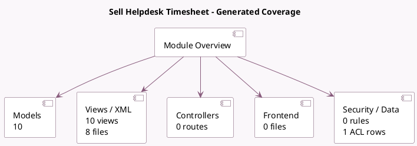

<!-- GENERATED:MODULE -->
---
tags: [odoo, enterprise, module]
---

# Sell Helpdesk Timesheet

- Scope: Enterprise Addons
- Source: enterprise/helpdesk_sale_timesheet
- Dependencies: [[docs/Enterprise Addons/helpdesk_timesheet/helpdesk_timesheet|helpdesk_timesheet]], [[docs/Enterprise Addons/sale_timesheet_enterprise/sale_timesheet_enterprise|sale_timesheet_enterprise]], [[docs/Enterprise Addons/helpdesk_sale/helpdesk_sale|helpdesk_sale]]

## Summary

Project, Helpdesk, Timesheet and Sale Orders

## Generated coverage

- Models: 10
- XML files with UI/data artifacts: 8
- Views: 10
- Actions: 0
- Menus: 0
- Rules (ir.rule): 0
- Access CSV entries: 1
- Controller units: 0
- Frontend asset files: 0

## Module map

## Detail notes

- Models: [[docs/Enterprise Addons/helpdesk_sale_timesheet/Models|Models]] (10)
- Views and XML: [[docs/Enterprise Addons/helpdesk_sale_timesheet/Views|Views]] (8 files)

## Key models

- `account.analytic.line`
- `helpdesk.sla`
- `helpdesk.sla.report.analysis`
- `helpdesk.team`
- `helpdesk.ticket`
- `helpdesk.ticket.convert.wizard`
- `helpdesk.ticket.report.analysis`
- `project.task.convert.wizard`
- `sale.order`
- `sale.order.line`

## Navigation

- [[../Enterprise Addons/Enterprise Addons|Back to scope]]
- [[../../docs/docs|Back to docs]]

<!-- GENERATED:MODULE -->

