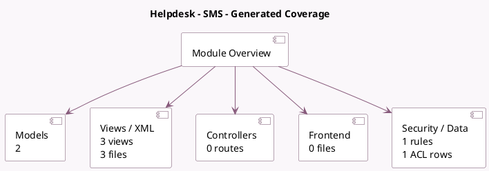

<!-- GENERATED:MODULE -->
---
tags: [odoo, enterprise, module]
---

# Helpdesk - SMS

- Scope: Enterprise Addons
- Source: enterprise/helpdesk_sms
- Dependencies: [[docs/Enterprise Addons/helpdesk/helpdesk|helpdesk]], [[docs/Community Addons/sms/sms|sms]]

## Summary

Send text messages when ticket stage move

## Generated coverage

- Models: 2
- XML files with UI/data artifacts: 3
- Views: 3
- Actions: 1
- Menus: 0
- Rules (ir.rule): 1
- Access CSV entries: 1
- Controller units: 0
- Frontend asset files: 0

## Module map

## Detail notes

- Models: [[docs/Enterprise Addons/helpdesk_sms/Models|Models]] (2)
- Views and XML: [[docs/Enterprise Addons/helpdesk_sms/Views|Views]] (3 files)

## Key models

- `helpdesk.stage`
- `helpdesk.ticket`

## Navigation

- [[../Enterprise Addons/Enterprise Addons|Back to scope]]
- [[../../docs/docs|Back to docs]]

<!-- GENERATED:MODULE -->

